# USB架构图和流程图详解（可视化版）

## 🎯 概述

本文档通过Mermaid图表直观展示USB系统的各个组成部分、数据流向和工作流程，帮助您深入理解USB技术的内部机制。建议在GitHub网页端或支持Mermaid的编辑器中查看以获得最佳视觉效果。

> 💡 **提示**: 如需在本地编辑器查看，请参考对应的ASCII版本文档。

## 1. USB系统整体架构

### 1.1 USB系统分层架构图

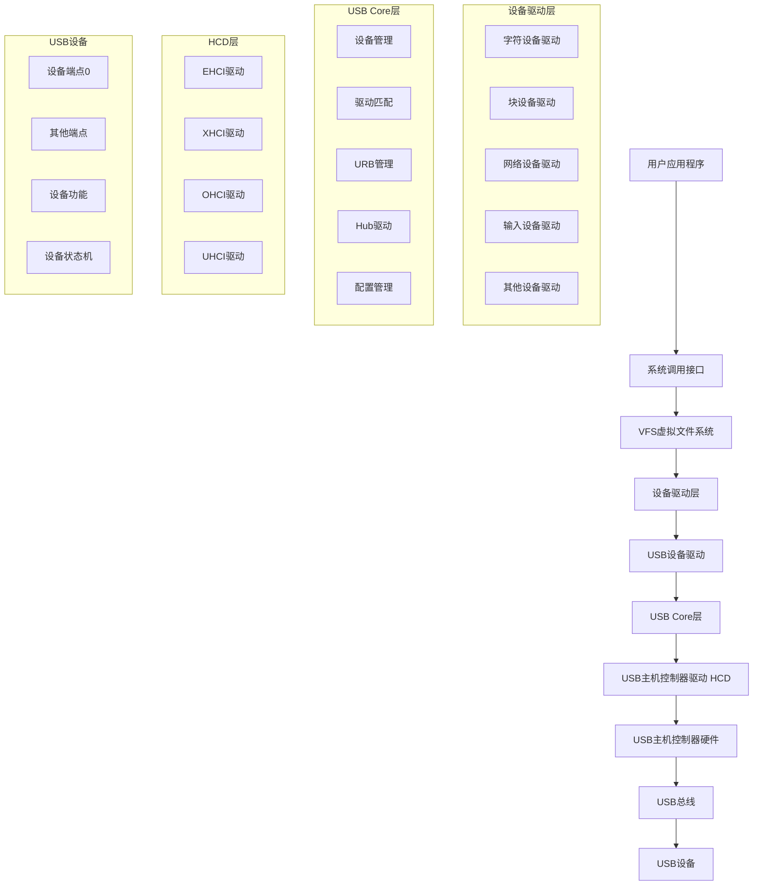
```mermaid
graph TB
    A[用户应用程序] --> B[系统调用接口]
    B --> C[VFS虚拟文件系统]
    C --> D[设备驱动层]
    
    subgraph "设备驱动层"
        D1[字符设备驱动]
        D2[块设备驱动] 
        D3[网络设备驱动]
        D4[输入设备驱动]
        D5[其他设备驱动]
    end
    
    D --> E[USB设备驱动]
    E --> F[USB Core层]
    
    subgraph "USB Core层"
        F1[设备管理]
        F2[驱动匹配]
        F3[URB管理]
        F4[Hub驱动]
        F5[配置管理]
    end
    
    F --> G[USB主机控制器驱动 HCD]
    
    subgraph "HCD层"
        G1[EHCI驱动]
        G2[XHCI驱动] 
        G3[OHCI驱动]
        G4[UHCI驱动]
    end
    
    G --> H[USB主机控制器硬件]
    H --> I[USB总线]
    I --> J[USB设备]
    
    subgraph "USB设备"
        J1[设备端点0]
        J2[其他端点]
        J3[设备功能]
        J4[设备状态机]
    end
    

```

### 1.2 Linux USB子系统架构

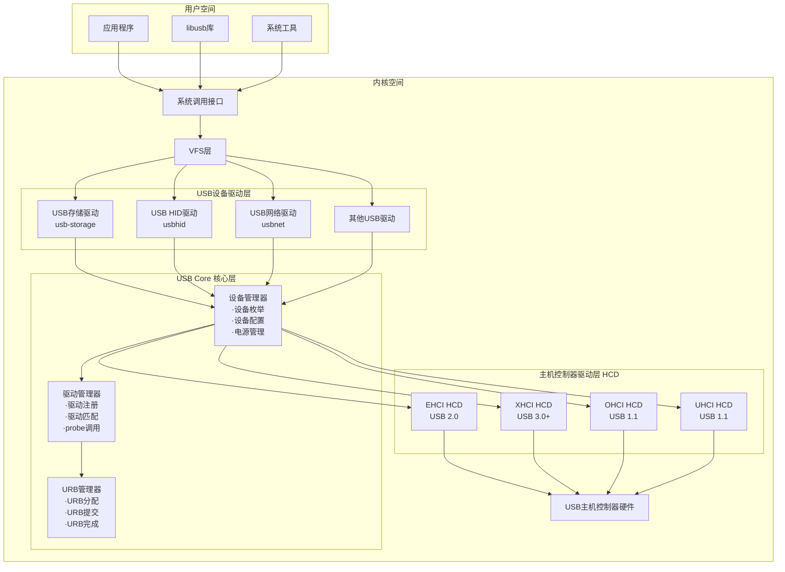
```mermaid
graph TD
    subgraph "用户空间"
        A1[应用程序]
        A2[libusb库]
        A3[系统工具]
    end
    
    subgraph "内核空间"
        B1[系统调用接口]
        B2[VFS层]
        
        subgraph "USB设备驱动层"
            C1[USB存储驱动<br/>usb-storage]
            C2[USB HID驱动<br/>usbhid]
            C3[USB网络驱动<br/>usbnet]
            C4[其他USB驱动]
        end
        
        subgraph "USB Core 核心层"
            D1[设备管理器<br/>·设备枚举<br/>·设备配置<br/>·电源管理]
            D2[驱动管理器<br/>·驱动注册<br/>·驱动匹配<br/>·probe调用]
            D3[URB管理器<br/>·URB分配<br/>·URB提交<br/>·URB完成]
        end
        
        subgraph "主机控制器驱动层 HCD"
            E1[EHCI HCD<br/>USB 2.0]
            E2[XHCI HCD<br/>USB 3.0+]
            E3[OHCI HCD<br/>USB 1.1]
            E4[UHCI HCD<br/>USB 1.1]
        end
        
        F[USB主机控制器硬件]
    end
    
    A1 --> B1
    A2 --> B1
    A3 --> B1
    
    B1 --> B2
    B2 --> C1
    B2 --> C2
    B2 --> C3
    B2 --> C4
    
    C1 --> D1
    C2 --> D1
    C3 --> D1
    C4 --> D1
    
    D1 --> D2
    D2 --> D3
    
    D1 --> E1
    D1 --> E2
    D1 --> E3
    D1 --> E4
    
    E1 --> F
    E2 --> F
    E3 --> F
    E4 --> F
    

```

## 2. USB设备枚举流程

### 2.1 设备插入检测流程

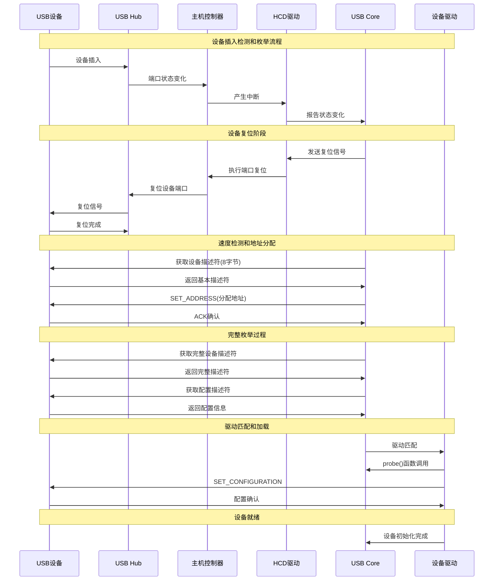
```mermaid
sequenceDiagram
    participant D as USB设备
    participant H as USB Hub
    participant HC as 主机控制器
    participant HCD as HCD驱动
    participant Core as USB Core
    participant Driver as 设备驱动
    
    Note over D,Driver: 设备插入检测和枚举流程
    
    D->>H: 设备插入
    H->>HC: 端口状态变化
    HC->>HCD: 产生中断
    HCD->>Core: 报告状态变化
    
    Note over D,Driver: 设备复位阶段
    Core->>HCD: 发送复位信号
    HCD->>HC: 执行端口复位
    HC->>H: 复位设备端口
    H->>D: 复位信号
    D->>H: 复位完成
    
    Note over D,Driver: 速度检测和地址分配
    Core->>D: 获取设备描述符(8字节)
    D->>Core: 返回基本描述符
    Core->>D: SET_ADDRESS(分配地址)
    D->>Core: ACK确认
    
    Note over D,Driver: 完整枚举过程
    Core->>D: 获取完整设备描述符
    D->>Core: 返回完整描述符
    Core->>D: 获取配置描述符
    D->>Core: 返回配置信息
    
    Note over D,Driver: 驱动匹配和加载
    Core->>Driver: 驱动匹配
    Driver->>Core: probe()函数调用
    Driver->>D: SET_CONFIGURATION
    D->>Driver: 配置确认
    
    Note over D,Driver: 设备就绪
    Driver->>Core: 设备初始化完成
```

### 2.2 设备状态机转换

```mermaid
stateDiagram-v2
    [*] --> Detached: 设备未连接
    
    Detached --> Attached: 物理插入
    Attached --> Powered: Hub供电
    Powered --> Default: 收到复位信号<br/>地址=0，端点0可用
    Default --> Address: SET_ADDRESS<br/>获得唯一地址
    Address --> Configured: SET_CONFIGURATION<br/>完全功能可用
    
    Configured --> Suspended: 挂起<br/>3ms无SOF
    Suspended --> Configured: 恢复信号
    
    Configured --> Default: USB复位
    Address --> Default: USB复位  
    Default --> Detached: 断开连接
    Suspended --> Detached: 断开连接
    Configured --> Detached: 严重错误
    
    note right of Default: 默认状态：地址0，只有端点0可用
    note right of Address: 地址状态：有唯一地址，可进行控制传输
    note right of Configured: 配置状态：所有端点可用，功能完全启用
    note right of Suspended: 挂起状态：低功耗模式，保持配置
```

## 3. USB数据传输流程

### 3.1 控制传输三阶段流程

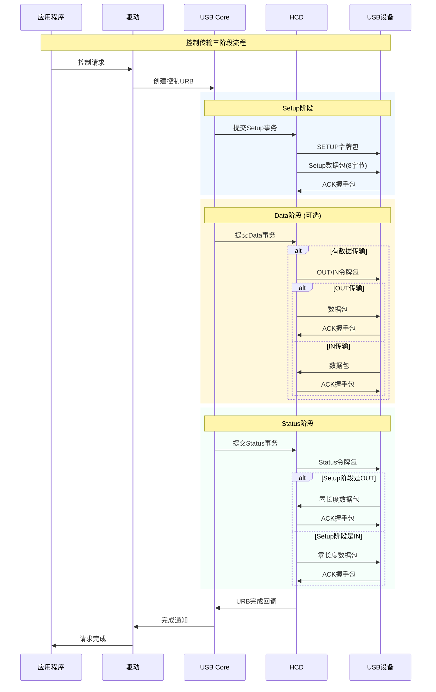
```mermaid
sequenceDiagram
    participant App as 应用程序
    participant Driver as 驱动
    participant Core as USB Core
    participant HCD as HCD
    participant Device as USB设备
    
    Note over App,Device: 控制传输三阶段流程
    
    App->>Driver: 控制请求
    Driver->>Core: 创建控制URB
    
    rect rgb(240, 248, 255)
        Note over Core,Device: Setup阶段
        Core->>HCD: 提交Setup事务
        HCD->>Device: SETUP令牌包
        HCD->>Device: Setup数据包(8字节)
        Device->>HCD: ACK握手包
    end
    
    rect rgb(255, 248, 220)
        Note over Core,Device: Data阶段 (可选)
        Core->>HCD: 提交Data事务
        alt 有数据传输
            HCD->>Device: OUT/IN令牌包
            alt OUT传输
                HCD->>Device: 数据包
                Device->>HCD: ACK握手包
            else IN传输
                Device->>HCD: 数据包
                HCD->>Device: ACK握手包
            end
        end
    end
    
    rect rgb(245, 255, 250)
        Note over Core,Device: Status阶段
        Core->>HCD: 提交Status事务
        HCD->>Device: Status令牌包
        alt Setup阶段是OUT
            Device->>HCD: 零长度数据包
            HCD->>Device: ACK握手包
        else Setup阶段是IN
            HCD->>Device: 零长度数据包
            Device->>HCD: ACK握手包
        end
    end
    
    HCD->>Core: URB完成回调
    Core->>Driver: 完成通知
    Driver->>App: 请求完成
```

### 3.2 批量传输流程

```mermaid
graph TD
    subgraph "批量传输写操作流程"
        A1[应用程序调用write] --> B1[驱动创建批量URB]
        B1 --> C1[USB Core调度传输]
        C1 --> D1[HCD处理URB队列]
        
        D1 --> E1[发送OUT令牌包]
        E1 --> F1[发送数据包]
        F1 --> G1[接收ACK确认]
        
        G1 --> H1{还有数据?}
        H1 -->|是| E1
        H1 -->|否| I1[URB完成]
        
        I1 --> J1[调用完成回调]
        J1 --> K1[write()返回]
    end
    
    subgraph "批量传输读操作流程"
        A2[应用程序调用read] --> B2[驱动创建批量URB]
        B2 --> C2[USB Core调度传输]
        C2 --> D2[HCD处理URB队列]
        
        D2 --> E2[发送IN令牌包]
        E2 --> F2[接收数据包]
        F2 --> G2[发送ACK确认]
        
        G2 --> H2{需要更多数据?}
        H2 -->|是| E2
        H2 -->|否| I2[URB完成]
        
        I2 --> J2[调用完成回调]
        J2 --> K2[read()返回]
    end
    

```

### 3.3 中断传输调度示意

```mermaid
gantt
    title USB中断传输调度示例（1ms帧周期）
    dateFormat X
    axisFormat %L ms
    
    section 帧0 (0-1ms)
    鼠标数据    :active, mouse0, 0, 250
    键盘数据    :active, kbd0, 250, 500  
    游戏手柄    :active, game0, 500, 750
    空闲时间    :idle0, 750, 1000
    
    section 帧1 (1-2ms)  
    鼠标数据    :active, mouse1, 1000, 1250
    键盘数据    :active, kbd1, 1250, 1500
    游戏手柄    :active, game1, 1500, 1750
    空闲时间    :idle1, 1750, 2000
    
    section 帧2 (2-3ms)
    鼠标数据    :active, mouse2, 2000, 2250  
    键盘数据    :active, kbd2, 2250, 2500
    游戏手柄    :active, game2, 2500, 2750
    空闲时间    :idle2, 2750, 3000
```

### 3.4 同步传输时序

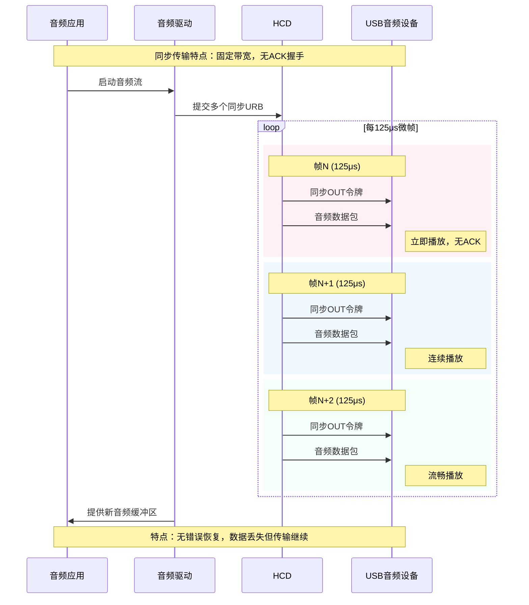
```mermaid
sequenceDiagram
    participant Audio as 音频应用
    participant Driver as 音频驱动
    participant HCD as HCD
    participant Device as USB音频设备
    
    Note over Audio,Device: 同步传输特点：固定带宽，无ACK握手
    
    Audio->>Driver: 启动音频流
    Driver->>HCD: 提交多个同步URB
    
    loop 每125μs微帧
        rect rgb(255, 240, 245)
            Note over HCD,Device: 帧N (125μs)
            HCD->>Device: 同步OUT令牌
            HCD->>Device: 音频数据包
            Note right of Device: 立即播放，无ACK
        end
        
        rect rgb(240, 248, 255) 
            Note over HCD,Device: 帧N+1 (125μs)
            HCD->>Device: 同步OUT令牌
            HCD->>Device: 音频数据包
            Note right of Device: 连续播放
        end
        
        rect rgb(245, 255, 250)
            Note over HCD,Device: 帧N+2 (125μs)  
            HCD->>Device: 同步OUT令牌
            HCD->>Device: 音频数据包
            Note right of Device: 流畅播放
        end
    end
    
    Driver->>Audio: 提供新音频缓冲区
    
    Note over Audio,Device: 特点：无错误恢复，数据丢失但传输继续
```

## 4. URB生命周期管理

### 4.1 URB状态转换图

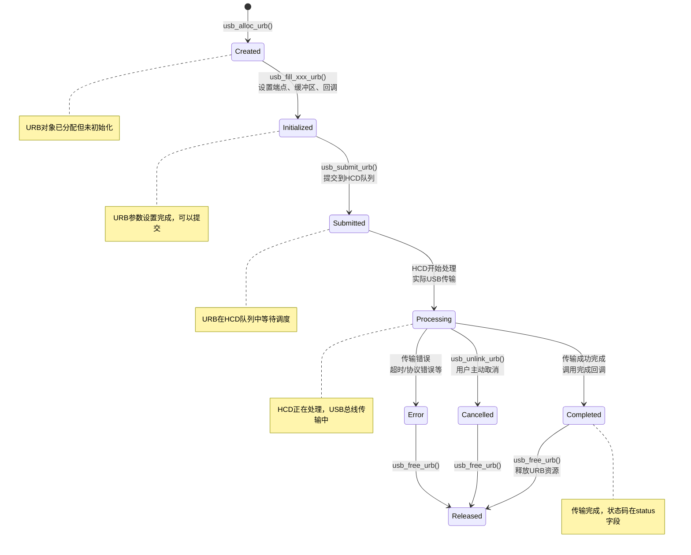
```mermaid
stateDiagram-v2
    [*] --> Created: usb_alloc_urb()
    
    Created --> Initialized: usb_fill_xxx_urb()<br/>设置端点、缓冲区、回调
    
    Initialized --> Submitted: usb_submit_urb()<br/>提交到HCD队列
    
    Submitted --> Processing: HCD开始处理<br/>实际USB传输
    
    Processing --> Completed: 传输成功完成<br/>调用完成回调
    Processing --> Cancelled: usb_unlink_urb()<br/>用户主动取消
    Processing --> Error: 传输错误<br/>超时/协议错误等
    
    Completed --> Released: usb_free_urb()<br/>释放URB资源
    Cancelled --> Released: usb_free_urb()
    Error --> Released: usb_free_urb()
    
    note right of Created: URB对象已分配但未初始化
    note right of Initialized: URB参数设置完成，可以提交
    note right of Submitted: URB在HCD队列中等待调度
    note right of Processing: HCD正在处理，USB总线传输中
    note right of Completed: 传输完成，状态码在status字段
```

### 4.2 URB处理详细流程

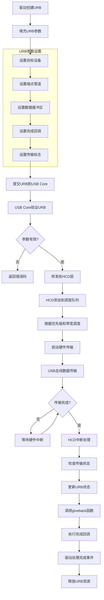
```mermaid
flowchart TD
    A[驱动创建URB] --> B[填充URB参数]
    
    subgraph "URB参数设置"
        B1[设置目标设备]
        B2[设置端点管道]  
        B3[设置数据缓冲区]
        B4[设置完成回调]
        B5[设置传输标志]
    end
    
    B --> B1
    B1 --> B2
    B2 --> B3  
    B3 --> B4
    B4 --> B5
    B5 --> C[提交URB到USB Core]
    
    C --> D[USB Core验证URB]
    
    D --> E{参数有效?}
    E -->|否| F[返回错误码]
    E -->|是| G[转发给HCD层]
    
    G --> H[HCD添加到调度队列]
    H --> I[根据优先级和带宽调度]
    
    I --> J[启动硬件传输]
    J --> K[USB总线数据传输]
    
    K --> L{传输完成?}
    L -->|否| M[等待硬件中断]
    M --> L
    L -->|是| N[HCD中断处理]
    
    N --> O[检查传输状态]
    O --> P[更新URB状态]
    P --> Q[调用giveback函数]
    Q --> R[执行完成回调]
    
    R --> S[驱动处理完成事件]
    S --> T[释放URB资源]
    

```

## 5. USB Hub工作原理

### 5.1 Hub内部结构图

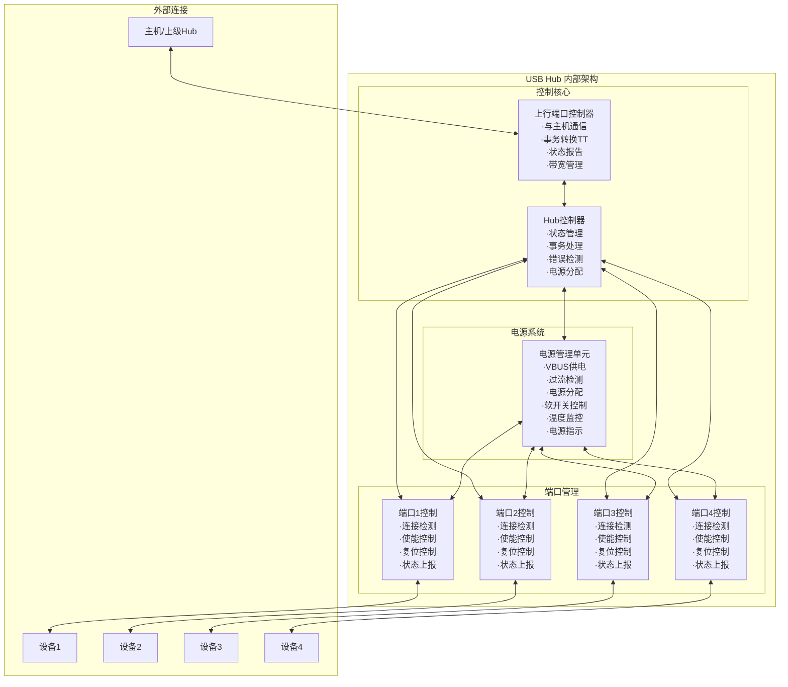
```mermaid
graph TB
    subgraph "USB Hub 内部架构"
        subgraph "控制核心"
            HC[Hub控制器<br/>·状态管理<br/>·事务处理<br/>·错误检测<br/>·电源分配]
            UPC[上行端口控制器<br/>·与主机通信<br/>·事务转换TT<br/>·状态报告<br/>·带宽管理]
        end
        
        subgraph "端口管理"
            P1[端口1控制<br/>·连接检测<br/>·使能控制<br/>·复位控制<br/>·状态上报]
            P2[端口2控制<br/>·连接检测<br/>·使能控制<br/>·复位控制<br/>·状态上报]  
            P3[端口3控制<br/>·连接检测<br/>·使能控制<br/>·复位控制<br/>·状态上报]
            P4[端口4控制<br/>·连接检测<br/>·使能控制<br/>·复位控制<br/>·状态上报]
        end
        
        subgraph "电源系统"
            PM[电源管理单元<br/>·VBUS供电<br/>·过流检测<br/>·电源分配<br/>·软开关控制<br/>·温度监控<br/>·电源指示]
        end
    end
    
    subgraph "外部连接"
        HOST[主机/上级Hub]
        DEV1[设备1]
        DEV2[设备2] 
        DEV3[设备3]
        DEV4[设备4]
    end
    
    HOST <--> UPC
    UPC <--> HC
    
    HC <--> P1
    HC <--> P2
    HC <--> P3
    HC <--> P4
    
    HC <--> PM
    PM <--> P1
    PM <--> P2
    PM <--> P3
    PM <--> P4
    
    P1 <--> DEV1
    P2 <--> DEV2
    P3 <--> DEV3
    P4 <--> DEV4
    

```

### 5.2 Hub事务处理流程

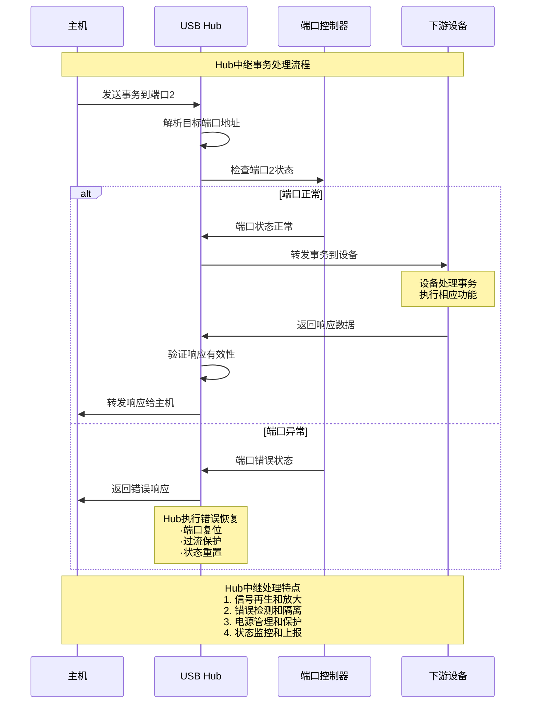
```mermaid
sequenceDiagram
    participant Host as 主机
    participant Hub as USB Hub
    participant Port as 端口控制器
    participant Device as 下游设备
    
    Note over Host,Device: Hub中继事务处理流程
    
    Host->>Hub: 发送事务到端口2
    Hub->>Hub: 解析目标端口地址
    Hub->>Port: 检查端口2状态
    
    alt 端口正常
        Port->>Hub: 端口状态正常
        Hub->>Device: 转发事务到设备
        
        Note over Device: 设备处理事务<br/>执行相应功能
        
        Device->>Hub: 返回响应数据
        Hub->>Hub: 验证响应有效性
        Hub->>Host: 转发响应给主机
    else 端口异常  
        Port->>Hub: 端口错误状态
        Hub->>Host: 返回错误响应
        
        Note over Hub: Hub执行错误恢复<br/>·端口复位<br/>·过流保护<br/>·状态重置
    end
    
    Note over Host,Device: Hub中继处理特点<br/>1. 信号再生和放大<br/>2. 错误检测和隔离<br/>3. 电源管理和保护<br/>4. 状态监控和上报
```

### 5.3 Hub端口状态管理

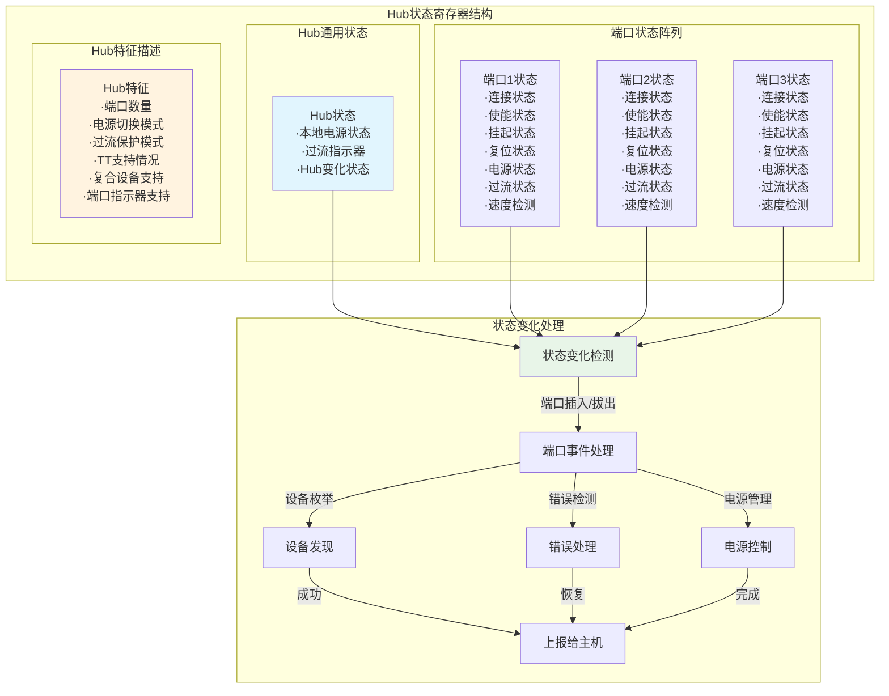
```mermaid
graph TD
    subgraph "Hub状态寄存器结构"
        subgraph "Hub通用状态"
            HS[Hub状态<br/>·本地电源状态<br/>·过流指示器<br/>·Hub变化状态]
        end
        
        subgraph "端口状态阵列"
            PS1[端口1状态<br/>·连接状态<br/>·使能状态<br/>·挂起状态<br/>·复位状态<br/>·电源状态<br/>·过流状态<br/>·速度检测]
            
            PS2[端口2状态<br/>·连接状态<br/>·使能状态<br/>·挂起状态<br/>·复位状态<br/>·电源状态<br/>·过流状态<br/>·速度检测]
            
            PS3[端口3状态<br/>·连接状态<br/>·使能状态<br/>·挂起状态<br/>·复位状态<br/>·电源状态<br/>·过流状态<br/>·速度检测]
        end
        
        subgraph "Hub特征描述"
            HF[Hub特征<br/>·端口数量<br/>·电源切换模式<br/>·过流保护模式<br/>·TT支持情况<br/>·复合设备支持<br/>·端口指示器支持]
        end
    end
    
    subgraph "状态变化处理"
        SC[状态变化检测] --> |端口插入/拔出| PE[端口事件处理]
        PE --> |设备枚举| DE[设备发现]
        PE --> |错误检测| EH[错误处理]
        PE --> |电源管理| PM[电源控制]
        
        DE --> |成功| RR[上报给主机]
        EH --> |恢复| RR
        PM --> |完成| RR
    end
    
    HS --> SC
    PS1 --> SC
    PS2 --> SC  
    PS3 --> SC
    
    style HS fill:#e1f5fe
    style HF fill:#fff3e0
    style SC fill:#e8f5e8
```

## 6. USB错误处理架构

### 6.1 错误检测和恢复流程

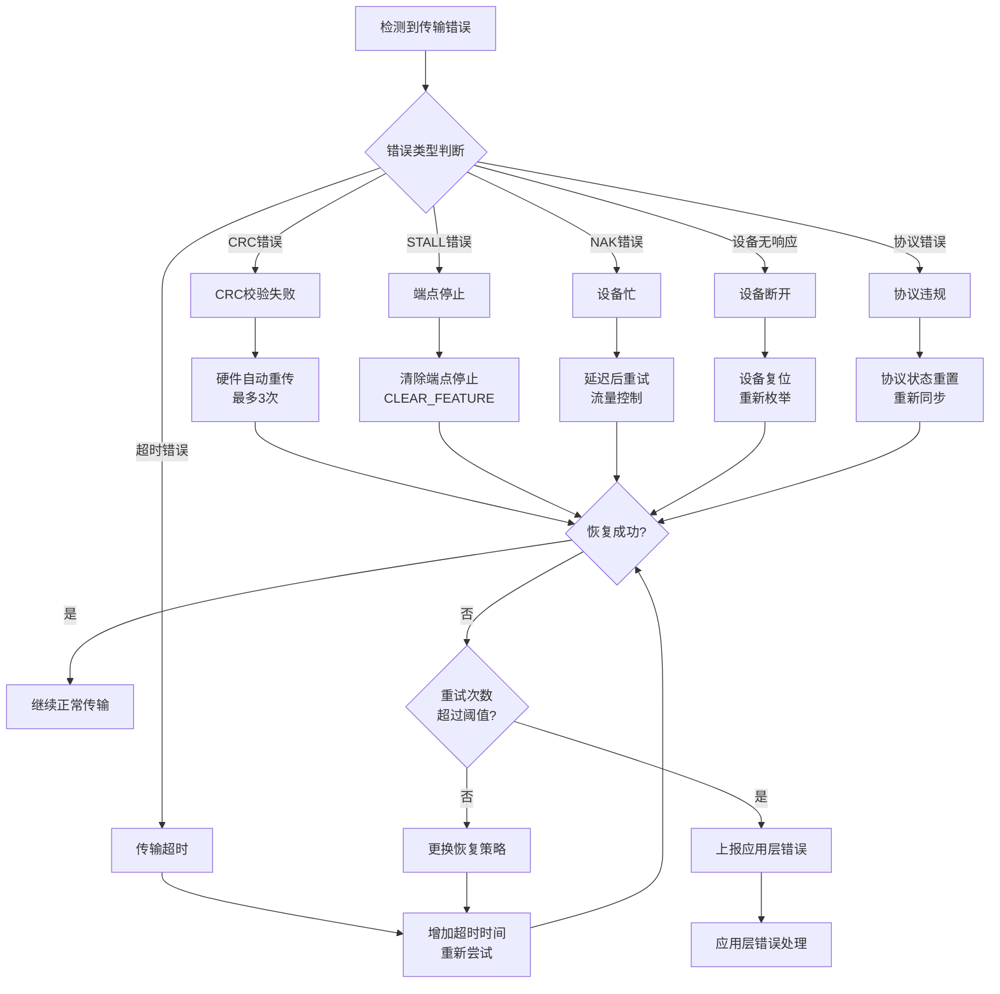
```mermaid
flowchart TD
    A[检测到传输错误] --> B{错误类型判断}
    
    B --> |CRC错误| C[CRC校验失败]
    B --> |超时错误| D[传输超时]  
    B --> |STALL错误| E[端点停止]
    B --> |NAK错误| F[设备忙]
    B --> |设备无响应| G[设备断开]
    B --> |协议错误| H[协议违规]
    
    C --> C1[硬件自动重传<br/>最多3次]
    D --> D1[增加超时时间<br/>重新尝试]
    E --> E1[清除端点停止<br/>CLEAR_FEATURE]
    F --> F1[延迟后重试<br/>流量控制]
    G --> G1[设备复位<br/>重新枚举]
    H --> H1[协议状态重置<br/>重新同步]
    
    C1 --> I{恢复成功?}
    D1 --> I
    E1 --> I  
    F1 --> I
    G1 --> I
    H1 --> I
    
    I --> |是| J[继续正常传输]
    I --> |否| K{重试次数<br/>超过阈值?}
    
    K --> |否| L[更换恢复策略]
    K --> |是| M[上报应用层错误]
    
    L --> D1
    M --> N[应用层错误处理]
    

```

### 6.2 多层错误处理协作

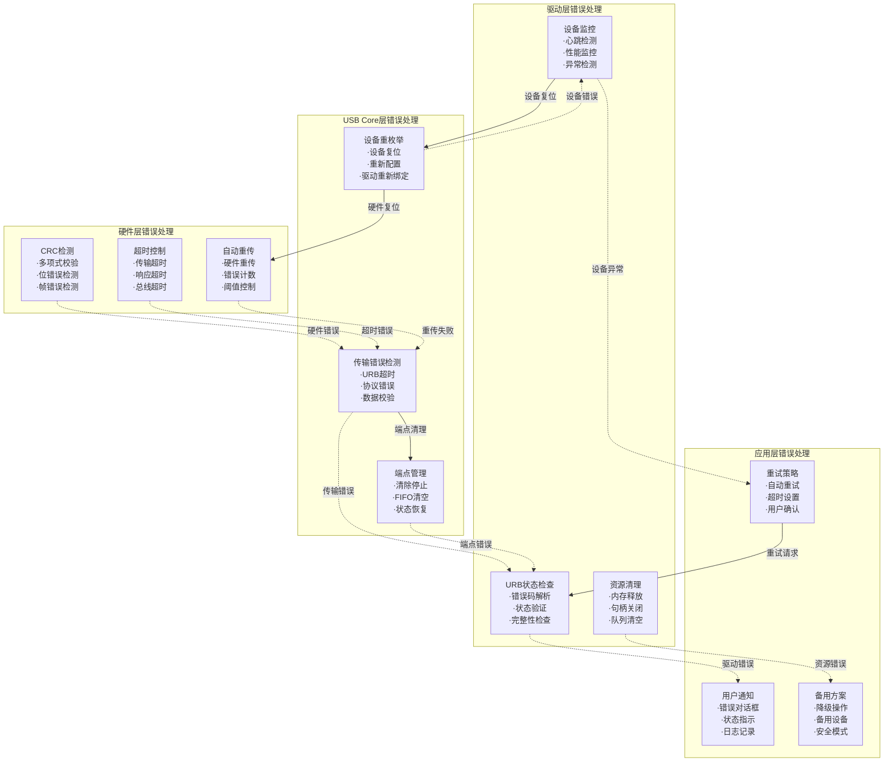
```mermaid
graph TB
    subgraph "应用层错误处理"
        A1[用户通知<br/>·错误对话框<br/>·状态指示<br/>·日志记录]
        A2[重试策略<br/>·自动重试<br/>·超时设置<br/>·用户确认]  
        A3[备用方案<br/>·降级操作<br/>·备用设备<br/>·安全模式]
    end
    
    subgraph "驱动层错误处理"  
        B1[URB状态检查<br/>·错误码解析<br/>·状态验证<br/>·完整性检查]
        B2[设备监控<br/>·心跳检测<br/>·性能监控<br/>·异常检测]
        B3[资源清理<br/>·内存释放<br/>·句柄关闭<br/>·队列清空]
    end
    
    subgraph "USB Core层错误处理"
        C1[传输错误检测<br/>·URB超时<br/>·协议错误<br/>·数据校验]  
        C2[设备重枚举<br/>·设备复位<br/>·重新配置<br/>·驱动重新绑定]
        C3[端点管理<br/>·清除停止<br/>·FIFO清空<br/>·状态恢复]
    end
    
    subgraph "硬件层错误处理"
        D1[CRC检测<br/>·多项式校验<br/>·位错误检测<br/>·帧错误检测]
        D2[超时控制<br/>·传输超时<br/>·响应超时<br/>·总线超时] 
        D3[自动重传<br/>·硬件重传<br/>·错误计数<br/>·阈值控制]
    end
    
    %% 错误上报流向
    D1 -.->|硬件错误| C1
    D2 -.->|超时错误| C1  
    D3 -.->|重传失败| C1
    
    C1 -.->|传输错误| B1
    C2 -.->|设备错误| B2
    C3 -.->|端点错误| B1
    
    B1 -.->|驱动错误| A1
    B2 -.->|设备异常| A2
    B3 -.->|资源错误| A3
    
    %% 错误处理协作
    A2 -->|重试请求| B1  
    B2 -->|设备复位| C2
    C1 -->|端点清理| C3
    C2 -->|硬件复位| D3
    

```

## 7. USB性能优化架构

### 7.1 USB带宽管理框架

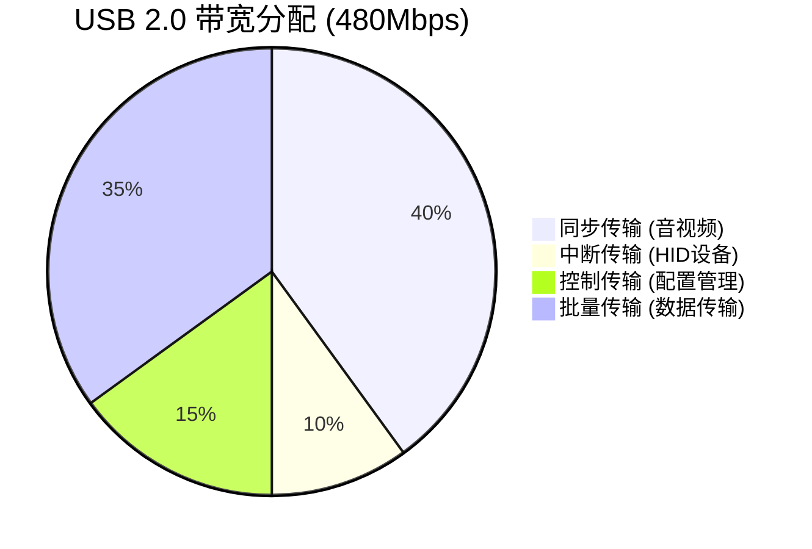
```mermaid
pie title USB 2.0 带宽分配 (480Mbps)
    "同步传输 (音视频)" : 40
    "中断传输 (HID设备)" : 10  
    "控制传输 (配置管理)" : 15
    "批量传输 (数据传输)" : 35
```

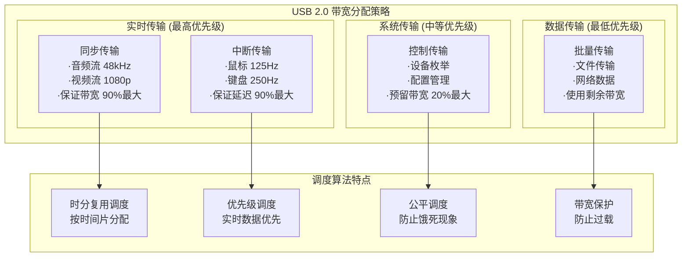
```mermaid
graph TD
    subgraph "USB 2.0 带宽分配策略"
        subgraph "实时传输 (最高优先级)"
            S1[同步传输<br/>·音频流 48kHz<br/>·视频流 1080p<br/>·保证带宽 90%最大]
            I1[中断传输<br/>·鼠标 125Hz<br/>·键盘 250Hz<br/>·保证延迟 90%最大]
        end
        
        subgraph "系统传输 (中等优先级)"  
            C1[控制传输<br/>·设备枚举<br/>·配置管理<br/>·预留带宽 20%最大]
        end
        
        subgraph "数据传输 (最低优先级)"
            B1[批量传输<br/>·文件传输<br/>·网络数据<br/>·使用剩余带宽]
        end
    end
    
    subgraph "调度算法特点"
        ALG1[时分复用调度<br/>按时间片分配]
        ALG2[优先级调度<br/>实时数据优先]  
        ALG3[公平调度<br/>防止饿死现象]
        ALG4[带宽保护<br/>防止过载]
    end
    
    S1 --> ALG1
    I1 --> ALG2
    C1 --> ALG3  
    B1 --> ALG4
    

```

### 7.2 多URB队列优化架构

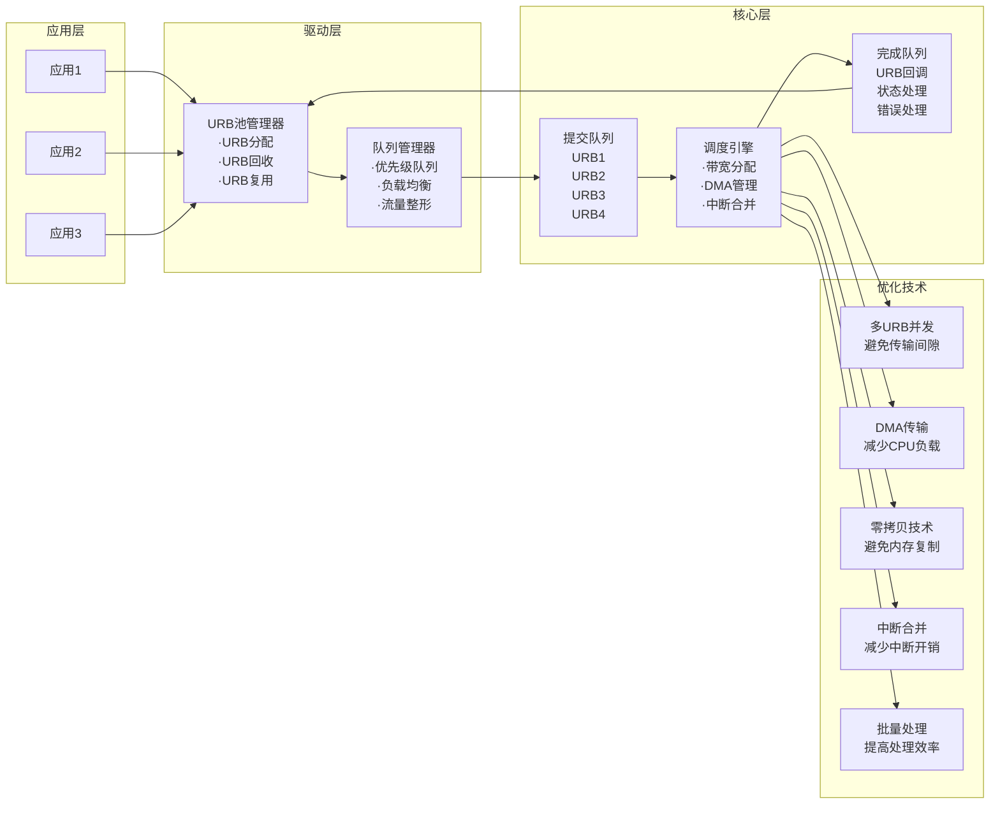
```mermaid
graph LR
    subgraph "应用层"
        A1[应用1]
        A2[应用2] 
        A3[应用3]
    end
    
    subgraph "驱动层"
        D1[URB池管理器<br/>·URB分配<br/>·URB回收<br/>·URB复用]
        
        D2[队列管理器<br/>·优先级队列<br/>·负载均衡<br/>·流量整形]
    end
    
    subgraph "核心层"
        C1[提交队列<br/>URB1<br/>URB2<br/>URB3<br/>URB4]
        
        C2[调度引擎<br/>·带宽分配<br/>·DMA管理<br/>·中断合并]
        
        C3[完成队列<br/>URB回调<br/>状态处理<br/>错误处理]
    end
    
    A1 --> D1
    A2 --> D1
    A3 --> D1
    
    D1 --> D2
    D2 --> C1
    C1 --> C2
    C2 --> C3
    C3 --> D1
    
    subgraph "优化技术"
        OPT1[多URB并发<br/>避免传输间隙]
        OPT2[DMA传输<br/>减少CPU负载]
        OPT3[零拷贝技术<br/>避免内存复制] 
        OPT4[中断合并<br/>减少中断开销]
        OPT5[批量处理<br/>提高处理效率]
    end
    
    C2 --> OPT1
    C2 --> OPT2
    C2 --> OPT3
    C2 --> OPT4
    C2 --> OPT5
    

```

### 7.3 USB 3.0+ 架构优势

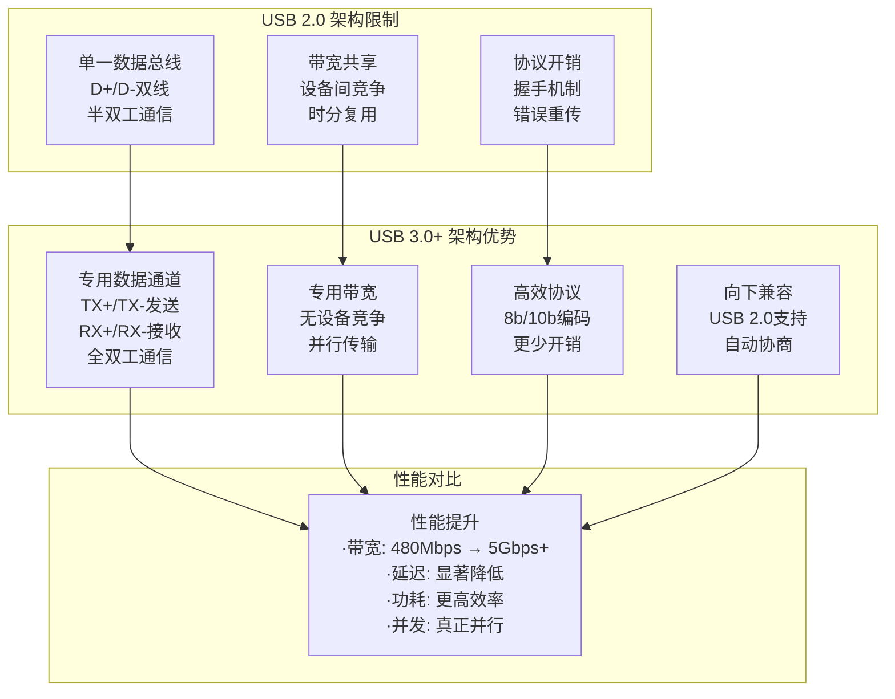
```mermaid
graph TB
    subgraph "USB 2.0 架构限制"
        U2_BUS[单一数据总线<br/>D+/D-双线<br/>半双工通信]
        U2_SHARE[带宽共享<br/>设备间竞争<br/>时分复用]
        U2_LIMIT[协议开销<br/>握手机制<br/>错误重传]
    end
    
    subgraph "USB 3.0+ 架构优势"  
        U3_BUS[专用数据通道<br/>TX+/TX-发送<br/>RX+/RX-接收<br/>全双工通信]
        U3_DEDIC[专用带宽<br/>无设备竞争<br/>并行传输]
        U3_EFFI[高效协议<br/>8b/10b编码<br/>更少开销]
        U3_COMPAT[向下兼容<br/>USB 2.0支持<br/>自动协商]
    end
    
    subgraph "性能对比"
        PERF[性能提升<br/>·带宽: 480Mbps → 5Gbps+<br/>·延迟: 显著降低<br/>·功耗: 更高效率<br/>·并发: 真正并行]
    end
    
    U2_BUS --> U3_BUS
    U2_SHARE --> U3_DEDIC
    U2_LIMIT --> U3_EFFI
    
    U3_BUS --> PERF
    U3_DEDIC --> PERF
    U3_EFFI --> PERF
    U3_COMPAT --> PERF
    

```

## 8. USB调试接口架构

### 8.1 USB调试和监控系统

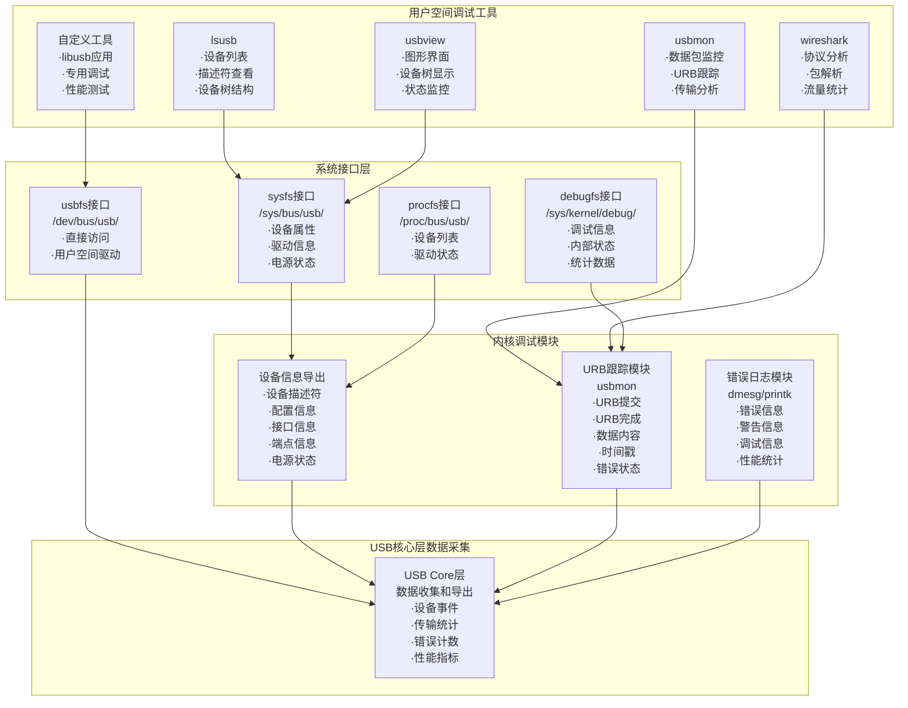
```mermaid
graph TB
    subgraph "用户空间调试工具"
        T1[lsusb<br/>·设备列表<br/>·描述符查看<br/>·设备树结构]
        T2[usbmon<br/>·数据包监控<br/>·URB跟踪<br/>·传输分析]
        T3[usbview<br/>·图形界面<br/>·设备树显示<br/>·状态监控]
        T4[wireshark<br/>·协议分析<br/>·包解析<br/>·流量统计]
        T5[自定义工具<br/>·libusb应用<br/>·专用调试<br/>·性能测试]
    end
    
    subgraph "系统接口层"
        I1[sysfs接口<br/>/sys/bus/usb/<br/>·设备属性<br/>·驱动信息<br/>·电源状态]
        I2[debugfs接口<br/>/sys/kernel/debug/<br/>·调试信息<br/>·内部状态<br/>·统计数据] 
        I3[procfs接口<br/>/proc/bus/usb/<br/>·设备列表<br/>·驱动状态]
        I4[usbfs接口<br/>/dev/bus/usb/<br/>·直接访问<br/>·用户空间驱动]
    end
    
    subgraph "内核调试模块"
        K1[设备信息导出<br/>·设备描述符<br/>·配置信息<br/>·接口信息<br/>·端点信息<br/>·电源状态]
        K2[URB跟踪模块<br/>usbmon<br/>·URB提交<br/>·URB完成<br/>·数据内容<br/>·时间戳<br/>·错误状态]
        K3[错误日志模块<br/>dmesg/printk<br/>·错误信息<br/>·警告信息<br/>·调试信息<br/>·性能统计]
    end
    
    subgraph "USB核心层数据采集"
        CORE[USB Core层<br/>数据收集和导出<br/>·设备事件<br/>·传输统计<br/>·错误计数<br/>·性能指标]
    end
    
    T1 --> I1
    T2 --> K2
    T3 --> I1
    T4 --> K2
    T5 --> I4
    
    I1 --> K1
    I2 --> K2
    I3 --> K1
    I4 --> CORE
    
    K1 --> CORE
    K2 --> CORE
    K3 --> CORE
    

```

### 8.2 调试数据流向图

```mermaid
flowchart TD
    A[USB传输事件] --> B{数据类型}
    
    B --> |设备信息| C[sysfs导出]
    B --> |URB数据| D[usbmon捕获]
    B --> |错误信息| E[dmesg日志]
    B --> |性能数据| F[debugfs统计]
    
    C --> G1[lsusb读取]
    C --> G2[usbview显示]
    
    D --> H1[wireshark分析]
    D --> H2[usbmon工具]
    
    E --> I1[dmesg查看]
    E --> I2[系统日志]
    
    F --> J1[性能监控]
    F --> J2[调试分析]
    
    subgraph "调试应用场景"
        G1 --> K1[设备识别问题]
        H1 --> K2[协议分析] 
        I1 --> K3[错误诊断]
        J1 --> K4[性能调优]
    end
    

```

## 总结

通过这些Mermaid图表，我们直观展示了USB系统的完整架构和工作流程：

### 🎯 **系统架构清晰展示**
- **分层架构图** - 清晰展示各层职责和接口关系
- **子系统结构** - 详细显示内核空间的模块组织
- **设备枚举** - 完整的时序图和状态转换图

### 🚀 **数据流程直观呈现**  
- **传输类型对比** - 四种传输类型的详细流程
- **URB生命周期** - 状态转换和处理流程图
- **错误处理机制** - 多层次的错误检测和恢复

### 💡 **性能优化可视化**
- **带宽分配策略** - 饼图和优先级展示
- **队列管理** - 多URB并发处理架构
- **调试系统** - 完整的调试数据流向

### 📊 **建议使用方式**

- **GitHub查看** - 获得最佳视觉体验，支持交互和缩放
- **本地开发** - 配合ASCII版本进行详细学习
- **文档编写** - 作为架构设计的参考模板
- **团队分享** - 直观的系统架构演示

这套可视化文档为您的USB驱动开发提供了更加直观和专业的参考资料！
