# USB系统框架图解（可视化版）

## 🎯 概述

本文档通过Mermaid图表从整体到具体、从宏观到微观的角度全面展示USB系统的完整架构。每个框架图都包含详细的功能说明和设计原理，帮助您建立对USB系统的完整认知。建议在GitHub网页端或支持Mermaid的编辑器中查看以获得最佳视觉效果。

> 💡 **提示**: 如需在本地编辑器查看，请参考对应的ASCII版本文档。

## 1. USB完整生态系统框架

### 1.1 USB系统全景架构

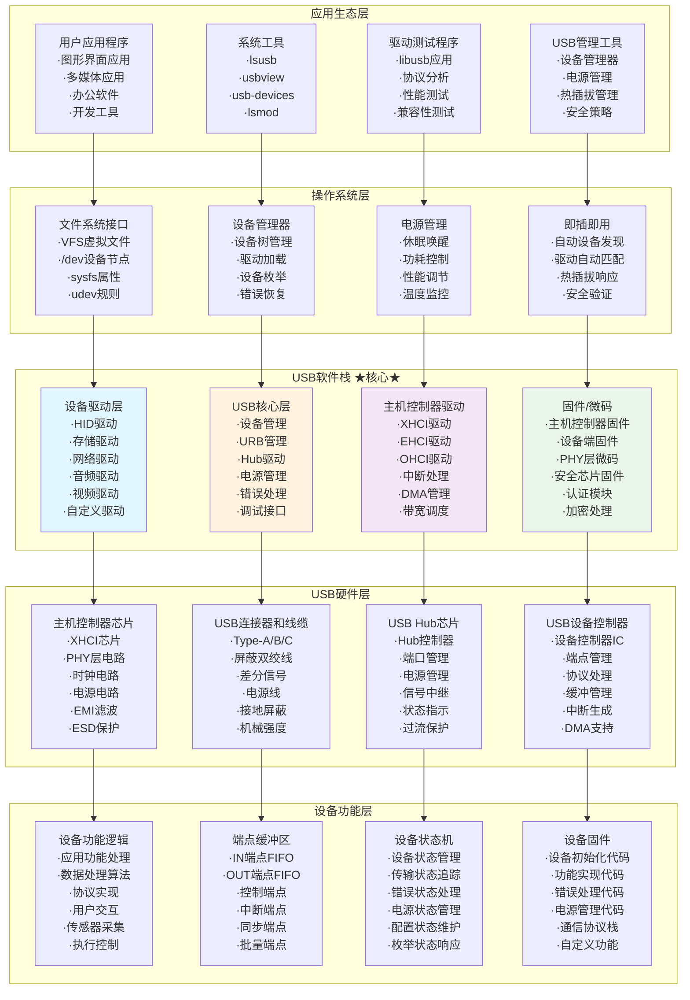
```mermaid
graph TB
    subgraph "应用生态层"
        A1[用户应用程序<br/>·图形界面应用<br/>·多媒体应用<br/>·办公软件<br/>·开发工具]
        A2[系统工具<br/>·lsusb<br/>·usbview<br/>·usb-devices<br/>·lsmod]
        A3[驱动测试程序<br/>·libusb应用<br/>·协议分析<br/>·性能测试<br/>·兼容性测试]
        A4[USB管理工具<br/>·设备管理器<br/>·电源管理<br/>·热插拔管理<br/>·安全策略]
    end
    
    subgraph "操作系统层"
        B1[文件系统接口<br/>·VFS虚拟文件<br/>·/dev设备节点<br/>·sysfs属性<br/>·udev规则]
        B2[设备管理器<br/>·设备树管理<br/>·驱动加载<br/>·设备枚举<br/>·错误恢复]
        B3[电源管理<br/>·休眠唤醒<br/>·功耗控制<br/>·性能调节<br/>·温度监控]
        B4[即插即用<br/>·自动设备发现<br/>·驱动自动匹配<br/>·热插拔响应<br/>·安全验证]
    end
    
    subgraph "USB软件栈 ★核心★"
        C1[设备驱动层<br/>·HID驱动<br/>·存储驱动<br/>·网络驱动<br/>·音频驱动<br/>·视频驱动<br/>·自定义驱动]
        C2[USB核心层<br/>·设备管理<br/>·URB管理<br/>·Hub驱动<br/>·电源管理<br/>·错误处理<br/>·调试接口]
        C3[主机控制器驱动<br/>·XHCI驱动<br/>·EHCI驱动<br/>·OHCI驱动<br/>·中断处理<br/>·DMA管理<br/>·带宽调度]
        C4[固件/微码<br/>·主机控制器固件<br/>·设备端固件<br/>·PHY层微码<br/>·安全芯片固件<br/>·认证模块<br/>·加密处理]
    end
    
    subgraph "USB硬件层"
        D1[主机控制器芯片<br/>·XHCI芯片<br/>·PHY层电路<br/>·时钟电路<br/>·电源电路<br/>·EMI滤波<br/>·ESD保护]
        D2[USB连接器和线缆<br/>·Type-A/B/C<br/>·屏蔽双绞线<br/>·差分信号<br/>·电源线<br/>·接地屏蔽<br/>·机械强度]
        D3[USB Hub芯片<br/>·Hub控制器<br/>·端口管理<br/>·电源管理<br/>·信号中继<br/>·状态指示<br/>·过流保护]
        D4[USB设备控制器<br/>·设备控制器IC<br/>·端点管理<br/>·协议处理<br/>·缓冲管理<br/>·中断生成<br/>·DMA支持]
    end
    
    subgraph "设备功能层"
        E1[设备功能逻辑<br/>·应用功能处理<br/>·数据处理算法<br/>·协议实现<br/>·用户交互<br/>·传感器采集<br/>·执行控制]
        E2[端点缓冲区<br/>·IN端点FIFO<br/>·OUT端点FIFO<br/>·控制端点<br/>·中断端点<br/>·同步端点<br/>·批量端点]
        E3[设备状态机<br/>·设备状态管理<br/>·传输状态追踪<br/>·错误状态处理<br/>·电源状态管理<br/>·配置状态维护<br/>·枚举状态响应]
        E4[设备固件<br/>·设备初始化代码<br/>·功能实现代码<br/>·错误处理代码<br/>·电源管理代码<br/>·通信协议栈<br/>·自定义功能]
    end
    
    %% 连接关系
    A1 --> B1
    A2 --> B2
    A3 --> B3
    A4 --> B4
    
    B1 --> C1
    B2 --> C2
    B3 --> C3
    B4 --> C4
    
    C1 --> D1
    C2 --> D2
    C3 --> D3
    C4 --> D4
    
    D1 --> E1
    D2 --> E2
    D3 --> E3
    D4 --> E4
    
    %% 样式设置
    style C1 fill:#e1f5fe
    style C2 fill:#fff3e0
    style C3 fill:#f3e5f5
    style C4 fill:#e8f5e8
```

**系统层次说明**：

- **应用生态层**：为用户提供直接接口和管理工具
- **操作系统层**：提供抽象的设备访问和系统服务
- **USB软件栈**：系统核心，实现USB协议和设备管理
- **USB硬件层**：物理硬件组件，提供USB总线基础
- **设备功能层**：实现具体设备功能和行为逻辑

## 2. USB硬件架构框架

### 2.1 USB主机端硬件架构

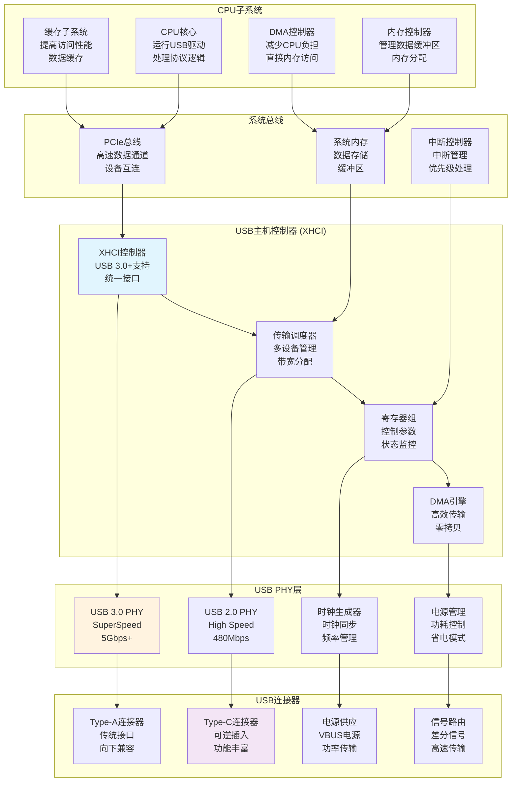
```mermaid
graph TD
    subgraph "CPU子系统"
        A1[CPU核心<br/>运行USB驱动<br/>处理协议逻辑]
        A2[内存控制器<br/>管理数据缓冲区<br/>内存分配]
        A3[缓存子系统<br/>提高访问性能<br/>数据缓存]
        A4[DMA控制器<br/>减少CPU负担<br/>直接内存访问]
    end
    
    subgraph "系统总线"
        B1[PCIe总线<br/>高速数据通道<br/>设备互连]
        B2[系统内存<br/>数据存储<br/>缓冲区]
        B3[中断控制器<br/>中断管理<br/>优先级处理]
    end
    
    subgraph "USB主机控制器 (XHCI)"
        C1[XHCI控制器<br/>USB 3.0+支持<br/>统一接口]
        C2[传输调度器<br/>多设备管理<br/>带宽分配]
        C3[寄存器组<br/>控制参数<br/>状态监控]
        C4[DMA引擎<br/>高效传输<br/>零拷贝]
    end
    
    subgraph "USB PHY层"
        D1[USB 3.0 PHY<br/>SuperSpeed<br/>5Gbps+]
        D2[USB 2.0 PHY<br/>High Speed<br/>480Mbps]
        D3[时钟生成器<br/>时钟同步<br/>频率管理]
        D4[电源管理<br/>功耗控制<br/>省电模式]
    end
    
    subgraph "USB连接器"
        E1[Type-A连接器<br/>传统接口<br/>向下兼容]
        E2[Type-C连接器<br/>可逆插入<br/>功能丰富]
        E3[电源供应<br/>VBUS电源<br/>功率传输]
        E4[信号路由<br/>差分信号<br/>高速传输]
    end
    
    %% 连接关系
    A1 --> B1
    A2 --> B2
    A3 --> B1
    A4 --> B2
    
    B1 --> C1
    B2 --> C2
    B3 --> C3
    
    C1 --> C2
    C2 --> C3
    C3 --> C4
    
    C1 --> D1
    C2 --> D2
    C3 --> D3
    C4 --> D4
    
    D1 --> E1
    D2 --> E2
    D3 --> E3
    D4 --> E4
    
    %% 样式
    style C1 fill:#e1f5fe
    style D1 fill:#fff3e0
    style E2 fill:#f3e5f5
```

**为什么选择XHCI**：
- 支持USB 3.0/2.0/1.1所有速度等级
- 统一的软件接口，简化驱动开发
- 更好的性能和功耗控制
- 向后兼容现有USB设备

### 2.2 USB设备端硬件架构

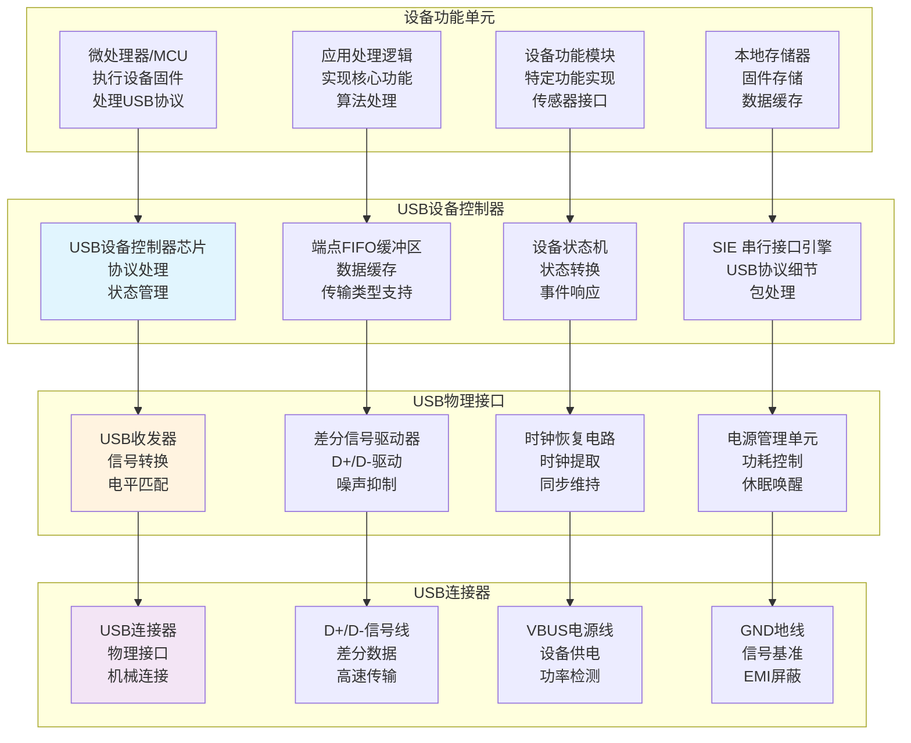
```mermaid
graph TD
    subgraph "设备功能单元"
        A1[微处理器/MCU<br/>执行设备固件<br/>处理USB协议]
        A2[应用处理逻辑<br/>实现核心功能<br/>算法处理]
        A3[设备功能模块<br/>特定功能实现<br/>传感器接口]
        A4[本地存储器<br/>固件存储<br/>数据缓存]
    end
    
    subgraph "USB设备控制器"
        B1[USB设备控制器芯片<br/>协议处理<br/>状态管理]
        B2[端点FIFO缓冲区<br/>数据缓存<br/>传输类型支持]
        B3[设备状态机<br/>状态转换<br/>事件响应]
        B4[SIE 串行接口引擎<br/>USB协议细节<br/>包处理]
    end
    
    subgraph "USB物理接口"
        C1[USB收发器<br/>信号转换<br/>电平匹配]
        C2[差分信号驱动器<br/>D+/D-驱动<br/>噪声抑制]
        C3[时钟恢复电路<br/>时钟提取<br/>同步维持]
        C4[电源管理单元<br/>功耗控制<br/>休眠唤醒]
    end
    
    subgraph "USB连接器"
        D1[USB连接器<br/>物理接口<br/>机械连接]
        D2[D+/D-信号线<br/>差分数据<br/>高速传输]
        D3[VBUS电源线<br/>设备供电<br/>功率检测]
        D4[GND地线<br/>信号基准<br/>EMI屏蔽]
    end
    
    %% 连接关系
    A1 --> B1
    A2 --> B2
    A3 --> B3
    A4 --> B4
    
    B1 --> C1
    B2 --> C2
    B3 --> C3
    B4 --> C4
    
    C1 --> D1
    C2 --> D2
    C3 --> D3
    C4 --> D4
    
    %% 样式
    style B1 fill:#e1f5fe
    style C1 fill:#fff3e0
    style D1 fill:#f3e5f5
```

**设备端组件功能**：
- **微处理器**：执行设备固件，处理USB协议和设备功能
- **SIE引擎**：串行接口引擎，处理USB协议底层细节
- **端点FIFO**：缓存收发数据，支持不同传输类型
- **状态机**：管理USB设备的各种状态转换

### 2.3 USB Hub内部架构

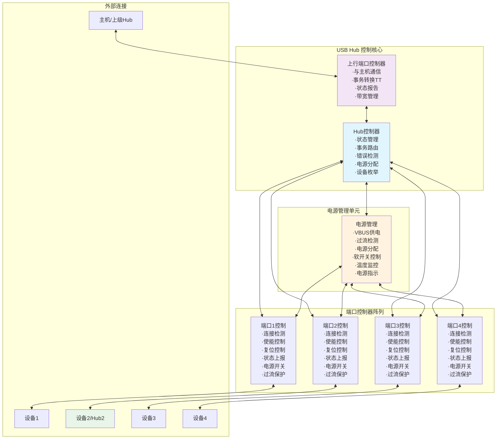
```mermaid
graph TB
    subgraph "USB Hub 控制核心"
        HC[Hub控制器<br/>·状态管理<br/>·事务路由<br/>·错误检测<br/>·电源分配<br/>·设备枚举]
        
        UPC[上行端口控制器<br/>·与主机通信<br/>·事务转换TT<br/>·状态报告<br/>·带宽管理]
    end
    
    subgraph "端口控制器阵列"
        P1[端口1控制<br/>·连接检测<br/>·使能控制<br/>·复位控制<br/>·状态上报<br/>·电源开关<br/>·过流保护]
        
        P2[端口2控制<br/>·连接检测<br/>·使能控制<br/>·复位控制<br/>·状态上报<br/>·电源开关<br/>·过流保护]
        
        P3[端口3控制<br/>·连接检测<br/>·使能控制<br/>·复位控制<br/>·状态上报<br/>·电源开关<br/>·过流保护]
        
        P4[端口4控制<br/>·连接检测<br/>·使能控制<br/>·复位控制<br/>·状态上报<br/>·电源开关<br/>·过流保护]
    end
    
    subgraph "电源管理单元"
        PM[电源管理<br/>·VBUS供电<br/>·过流检测<br/>·电源分配<br/>·软开关控制<br/>·温度监控<br/>·电源指示]
    end
    
    subgraph "外部连接"
        HOST[主机/上级Hub]
        DEV1[设备1]
        DEV2[设备2/Hub2]
        DEV3[设备3] 
        DEV4[设备4]
    end
    
    %% 连接关系
    HOST <--> UPC
    UPC <--> HC
    
    HC <--> P1
    HC <--> P2
    HC <--> P3
    HC <--> P4
    
    HC <--> PM
    PM <--> P1
    PM <--> P2
    PM <--> P3
    PM <--> P4
    
    P1 <--> DEV1
    P2 <--> DEV2
    P3 <--> DEV3
    P4 <--> DEV4
    
    %% 样式
    style HC fill:#e1f5fe
    style PM fill:#fff3e0
    style UPC fill:#f3e5f5
    style DEV2 fill:#e8f5e8
```

**Hub设计原理**：
1. **层次化管理**：支持最多127个设备的树形拓扑结构
2. **信号再生**：延长USB总线传输距离，保证信号质量
3. **电源分配**：为下游设备提供独立的电源管理
4. **故障隔离**：防止单个设备故障影响整个总线

## 3. USB数据流架构

### 3.1 主机到设备数据流

```mermaid
flowchart LR
    subgraph "主机端"
        A[应用程序<br/>数据生成]
        B[设备驱动<br/>数据封装<br/>URB创建]
        C[USB Core层<br/>URB调度<br/>带宽管理]
        D[HCD层<br/>硬件控制<br/>DMA传输]
    end
    
    subgraph "USB总线"
        E[USB协议处理层<br/>包格式化<br/>错误检测]
        F[USB物理传输<br/>信号层<br/>差分传输]
    end
    
    subgraph "设备端"
        G[设备控制器<br/>协议解析<br/>状态管理]
        H[端点FIFO<br/>缓冲管理<br/>数据排队]
        I[设备应用逻辑<br/>数据处理<br/>功能实现]
    end
    
    %% 数据流向
    A --> B
    B --> C
    C --> D
    D --> E
    E --> F
    F --> G
    G --> H
    H --> I
    
    %% 反向流程
    I -.->|响应数据| H
    H -.->|状态反馈| G
    G -.->|响应包| F
    F -.->|返回数据| E
    E -.->|完成通知| D
    D -.->|URB完成| C
    C -.->|回调通知| B
    B -.->|操作结果| A
    
    %% 特点说明
    style C fill:#e1f5fe
    style F fill:#fff3e0
    style H fill:#f3e5f5
```

**数据流特点**：
- **分层处理**：每层负责特定的数据转换和处理
- **异步传输**：支持多个数据流并发处理  
- **缓冲机制**：各层都有缓冲区平衡速度差异
- **错误检测**：每层都有相应的错误检测和恢复
- **流量控制**：实现端到端的流量控制和拥塞避免

### 3.2 控制传输数据流详解

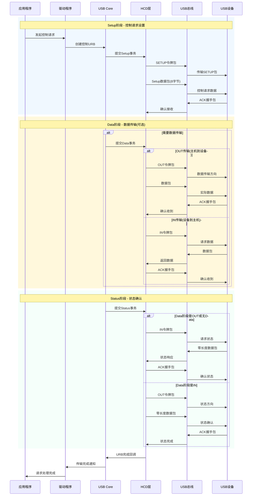
```mermaid
sequenceDiagram
    participant App as 应用程序
    participant Driver as 驱动程序
    participant Core as USB Core
    participant HCD as HCD层
    participant Bus as USB总线
    participant Device as USB设备
    
    rect rgb(240, 248, 255)
        Note over App,Device: Setup阶段 - 控制请求设置
        App->>Driver: 发起控制请求
        Driver->>Core: 创建控制URB
        Core->>HCD: 提交Setup事务
        HCD->>Bus: SETUP令牌包
        Bus->>Device: 传输SETUP包
        HCD->>Bus: Setup数据包(8字节)
        Bus->>Device: 控制请求数据
        Device->>Bus: ACK握手包
        Bus->>HCD: 确认接收
    end
    
    rect rgb(255, 248, 220)
        Note over App,Device: Data阶段 - 数据传输(可选)
        alt 需要数据传输
            Core->>HCD: 提交Data事务
            alt OUT传输(主机到设备)
                HCD->>Bus: OUT令牌包
                Bus->>Device: 数据传输方向
                HCD->>Bus: 数据包
                Bus->>Device: 实际数据
                Device->>Bus: ACK握手包
                Bus->>HCD: 确认收到
            else IN传输(设备到主机)
                HCD->>Bus: IN令牌包  
                Bus->>Device: 请求数据
                Device->>Bus: 数据包
                Bus->>HCD: 返回数据
                HCD->>Bus: ACK握手包
                Bus->>Device: 确认收到
            end
        end
    end
    
    rect rgb(245, 255, 250)
        Note over App,Device: Status阶段 - 状态确认
        Core->>HCD: 提交Status事务
        alt Data阶段是OUT或无Data
            HCD->>Bus: IN令牌包
            Bus->>Device: 请求状态
            Device->>Bus: 零长度数据包
            Bus->>HCD: 状态响应
            HCD->>Bus: ACK握手包
            Bus->>Device: 确认状态
        else Data阶段是IN
            HCD->>Bus: OUT令牌包
            Bus->>Device: 状态方向
            HCD->>Bus: 零长度数据包
            Bus->>Device: 状态确认
            Device->>Bus: ACK握手包
            Bus->>HCD: 状态完成
        end
    end
    
    HCD->>Core: URB完成回调
    Core->>Driver: 传输完成通知
    Driver->>App: 请求处理完成
```

## 4. USB设备状态管理

### 4.1 设备状态转换架构

```mermaid
stateDiagram-v2
    [*] --> Detached: 设备未连接
    
    state "设备生命周期" as lifecycle {
        Detached --> Attached: 物理连接检测
        Attached --> Powered: Hub端口供电
        Powered --> Default: USB复位信号<br/>地址=0，端点0
        
        state "地址分配" as addressing {
            Default --> Address: SET_ADDRESS<br/>获得唯一地址
        }
        
        state "设备配置" as configuration {
            Address --> Configured: SET_CONFIGURATION<br/>激活所有端点
        }
        
        state "电源管理" as power {
            Configured --> Suspended: 挂起信号<br/>3ms无SOF
            Suspended --> Configured: 恢复信号<br/>任何USB活动
        }
    }
    
    %% 错误恢复路径
    Configured --> Default: USB总线复位
    Address --> Default: USB总线复位
    Suspended --> Default: USB总线复位
    
    %% 断开路径
    Configured --> Detached: 物理断开
    Suspended --> Detached: 物理断开
    Address --> Detached: 严重错误
    Default --> Detached: 连接失败
    Attached --> Detached: 供电失败
    
    note right of Default
        默认状态特点:
        - 地址为0
        - 只有端点0可用
        - 只能响应控制传输
        - 用于设备枚举
    end note
    
    note right of Configured  
        配置状态特点:
        - 所有端点激活
        - 功能完全可用
        - 可处理所有传输类型
        - 正常工作状态
    end note
```

### 4.2 端点状态管理架构

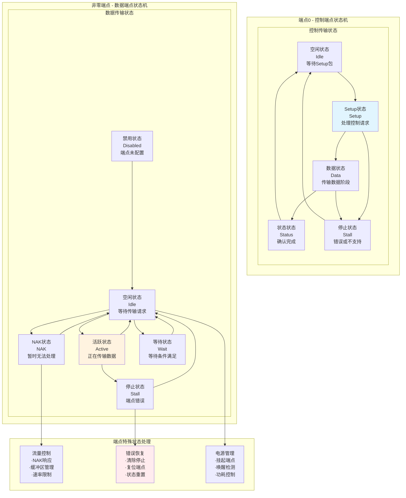
```mermaid
graph TD
    subgraph "端点0 - 控制端点状态机"
        subgraph "控制传输状态"
            C1[空闲状态<br/>Idle<br/>等待Setup包]
            C2[Setup状态<br/>Setup<br/>处理控制请求]
            C3[数据状态<br/>Data<br/>传输数据阶段]
            C4[状态状态<br/>Status<br/>确认完成]
            C5[停止状态<br/>Stall<br/>错误或不支持]
        end
        
        C1 --> C2
        C2 --> C3
        C3 --> C4
        C4 --> C1
        C2 --> C5
        C3 --> C5
        C5 --> C1
    end
    
    subgraph "非零端点 - 数据端点状态机"
        subgraph "数据传输状态"
            D1[空闲状态<br/>Idle<br/>等待传输请求]
            D2[活跃状态<br/>Active<br/>正在传输数据]
            D3[停止状态<br/>Stall<br/>端点错误]
            D4[禁用状态<br/>Disabled<br/>端点未配置]
            D5[NAK状态<br/>NAK<br/>暂时无法处理]
            D6[等待状态<br/>Wait<br/>等待条件满足]
        end
        
        D4 --> D1
        D1 --> D2
        D2 --> D1
        D1 --> D5
        D5 --> D1
        D2 --> D3
        D3 --> D1
        D1 --> D6
        D6 --> D1
    end
    
    subgraph "端点特殊状态处理"
        E1[流量控制<br/>·NAK响应<br/>·缓冲区管理<br/>·速率限制]
        E2[错误恢复<br/>·清除停止<br/>·复位端点<br/>·状态重置]
        E3[电源管理<br/>·挂起端点<br/>·唤醒检测<br/>·功耗控制]
    end
    
    D5 --> E1
    D3 --> E2
    D1 --> E3
    
    %% 样式
    style C2 fill:#e1f5fe
    style D2 fill:#fff3e0
    style E2 fill:#ffebee
```

## 5. USB错误处理和恢复

### 5.1 多层错误处理协作架构

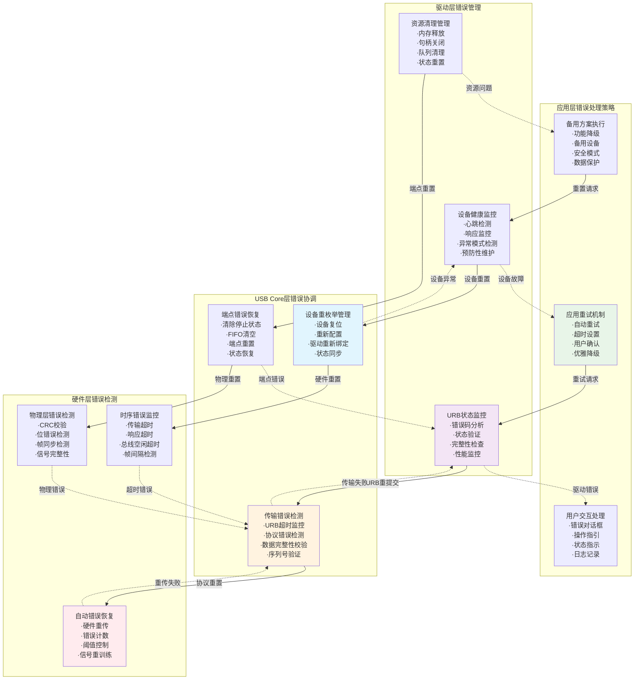
```mermaid
graph TB
    subgraph "应用层错误处理策略"
        A1[用户交互处理<br/>·错误对话框<br/>·操作指引<br/>·状态指示<br/>·日志记录]
        A2[应用重试机制<br/>·自动重试<br/>·超时设置<br/>·用户确认<br/>·优雅降级]
        A3[备用方案执行<br/>·功能降级<br/>·备用设备<br/>·安全模式<br/>·数据保护]
    end
    
    subgraph "驱动层错误管理" 
        B1[URB状态监控<br/>·错误码分析<br/>·状态验证<br/>·完整性检查<br/>·性能监控]
        B2[设备健康监控<br/>·心跳检测<br/>·响应监控<br/>·异常模式检测<br/>·预防性维护]
        B3[资源清理管理<br/>·内存释放<br/>·句柄关闭<br/>·队列清理<br/>·状态重置]
    end
    
    subgraph "USB Core层错误协调"
        C1[传输错误检测<br/>·URB超时监控<br/>·协议错误检测<br/>·数据完整性校验<br/>·序列号验证]
        C2[设备重枚举管理<br/>·设备复位<br/>·重新配置<br/>·驱动重新绑定<br/>·状态同步]
        C3[端点错误恢复<br/>·清除停止状态<br/>·FIFO清空<br/>·端点重置<br/>·状态恢复]
    end
    
    subgraph "硬件层错误检测"
        D1[物理层错误检测<br/>·CRC校验<br/>·位错误检测<br/>·帧同步检测<br/>·信号完整性]
        D2[时序错误监控<br/>·传输超时<br/>·响应超时<br/>·总线空闲超时<br/>·帧间隔检测]
        D3[自动错误恢复<br/>·硬件重传<br/>·错误计数<br/>·阈值控制<br/>·信号重训练]
    end
    
    %% 错误上报流
    D1 -.->|物理错误| C1
    D2 -.->|超时错误| C1
    D3 -.->|重传失败| C1
    
    C1 -.->|传输失败| B1
    C2 -.->|设备异常| B2
    C3 -.->|端点错误| B1
    
    B1 -.->|驱动错误| A1
    B2 -.->|设备故障| A2
    B3 -.->|资源问题| A3
    
    %% 错误处理协作流
    A2 -->|重试请求| B1
    A3 -->|重置请求| B2
    
    B1 -->|URB重提交| C1
    B2 -->|设备重置| C2
    B3 -->|端点重置| C3
    
    C1 -->|协议重置| D3
    C2 -->|硬件重置| D2
    C3 -->|物理重置| D1
    
    %% 样式
    style C1 fill:#fff3e0
    style C2 fill:#e1f5fe
    style B1 fill:#f3e5f5
    style A2 fill:#e8f5e8
    style D3 fill:#ffebee
```

### 5.2 错误恢复决策流程

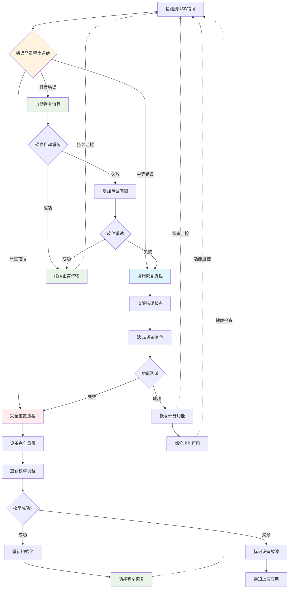
```mermaid
flowchart TD
    A[检测到USB错误] --> B{错误严重程度评估}
    
    B --> |轻微错误| C[自动恢复流程]
    B --> |中等错误| D[协调恢复流程]  
    B --> |严重错误| E[完全重置流程]
    
    C --> C1{硬件自动重传}
    C1 --> |成功| F[继续正常传输]
    C1 --> |失败| C2[增加重试间隔]
    C2 --> C3{软件重试}
    C3 --> |成功| F
    C3 --> |失败| D
    
    D --> D1[清除错误状态]
    D1 --> D2[端点/设备复位]
    D2 --> D3{功能测试}
    D3 --> |成功| G[恢复部分功能]
    D3 --> |失败| E
    
    E --> E1[设备完全重置]
    E1 --> E2[重新枚举设备]
    E2 --> E3{枚举成功?}
    E3 --> |成功| H[重新初始化]
    E3 --> |失败| I[标记设备故障]
    
    H --> J[功能完全恢复]
    G --> K[部分功能可用]
    I --> L[通知上层应用]
    
    %% 监控反馈
    F -.->|持续监控| A
    G -.->|状态监控| A
    J -.->|健康检查| A
    K -.->|功能监控| A
    
    %% 样式
    style B fill:#fff3e0
    style C fill:#e8f5e8
    style D fill:#e1f5fe
    style E fill:#ffebee
    style F fill:#e8f5e8
    style J fill:#e8f5e8
```

## 6. USB带宽分配和性能优化

### 6.1 USB 2.0带宽管理架构

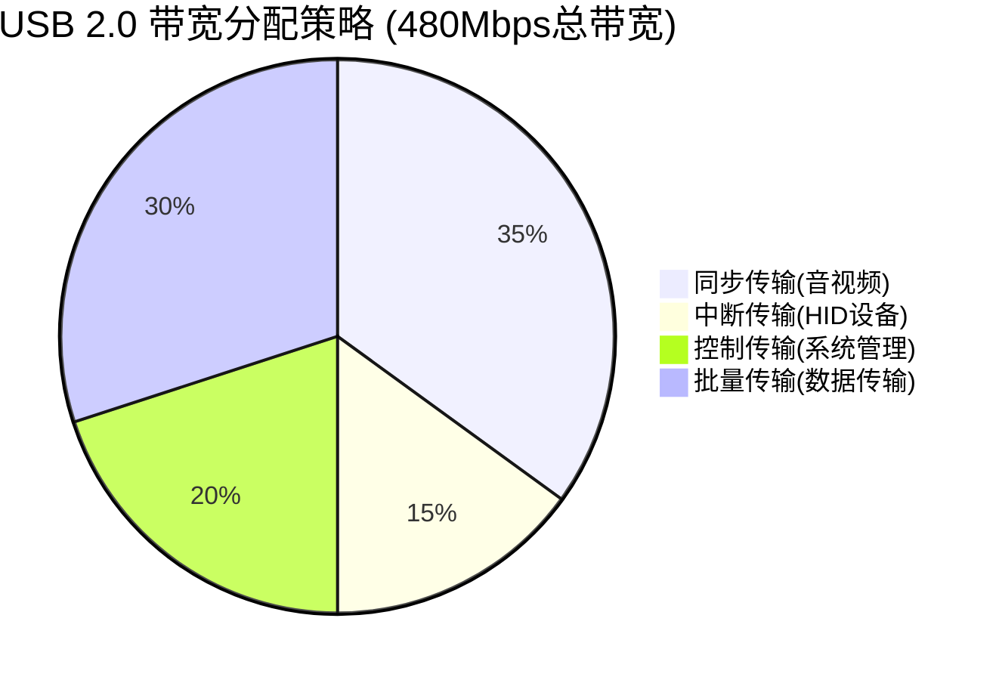
```mermaid
pie title USB 2.0 带宽分配策略 (480Mbps总带宽)
    "同步传输(音视频)" : 35
    "中断传输(HID设备)" : 15
    "控制传输(系统管理)" : 20
    "批量传输(数据传输)" : 30
```

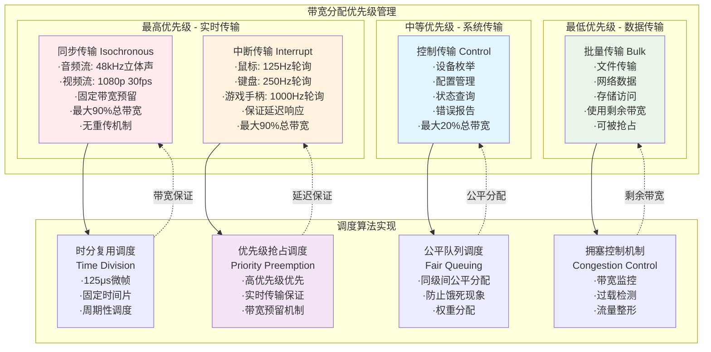
```mermaid
graph TD
    subgraph "带宽分配优先级管理"
        subgraph "最高优先级 - 实时传输"
            P1[同步传输 Isochronous<br/>·音频流: 48kHz立体声<br/>·视频流: 1080p 30fps<br/>·固定带宽预留<br/>·最大90%总带宽<br/>·无重传机制]
            
            P2[中断传输 Interrupt<br/>·鼠标: 125Hz轮询<br/>·键盘: 250Hz轮询<br/>·游戏手柄: 1000Hz轮询<br/>·保证延迟响应<br/>·最大90%总带宽]
        end
        
        subgraph "中等优先级 - 系统传输"
            P3[控制传输 Control<br/>·设备枚举<br/>·配置管理<br/>·状态查询<br/>·错误报告<br/>·最大20%总带宽]
        end
        
        subgraph "最低优先级 - 数据传输"
            P4[批量传输 Bulk<br/>·文件传输<br/>·网络数据<br/>·存储访问<br/>·使用剩余带宽<br/>·可被抢占]
        end
    end
    
    subgraph "调度算法实现"
        S1[时分复用调度<br/>Time Division<br/>·125μs微帧<br/>·固定时间片<br/>·周期性调度]
        
        S2[优先级抢占调度<br/>Priority Preemption<br/>·高优先级优先<br/>·实时传输保证<br/>·带宽预留机制]
        
        S3[公平队列调度<br/>Fair Queuing<br/>·同级间公平分配<br/>·防止饿死现象<br/>·权重分配]
        
        S4[拥塞控制机制<br/>Congestion Control<br/>·带宽监控<br/>·过载检测<br/>·流量整形]
    end
    
    P1 --> S1
    P2 --> S2
    P3 --> S3
    P4 --> S4
    
    %% 带宽保证连接
    S1 -.->|带宽保证| P1
    S2 -.->|延迟保证| P2
    S3 -.->|公平分配| P3
    S4 -.->|剩余带宽| P4
    
    %% 样式
    style P1 fill:#ffebee
    style P2 fill:#fff3e0
    style P3 fill:#e1f5fe
    style P4 fill:#e8f5e8
    style S2 fill:#f3e5f5
```

### 6.2 多URB队列性能优化

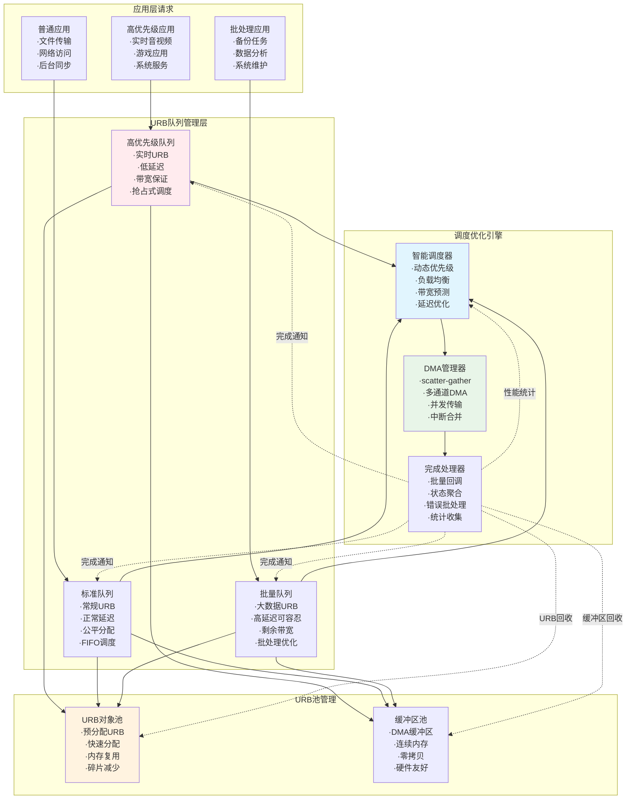
```mermaid
graph TB
    subgraph "应用层请求"
        A1[高优先级应用<br/>·实时音视频<br/>·游戏应用<br/>·系统服务]
        A2[普通应用<br/>·文件传输<br/>·网络访问<br/>·后台同步]
        A3[批处理应用<br/>·备份任务<br/>·数据分析<br/>·系统维护]
    end
    
    subgraph "URB队列管理层"
        Q1[高优先级队列<br/>·实时URB<br/>·低延迟<br/>·带宽保证<br/>·抢占式调度]
        
        Q2[标准队列<br/>·常规URB<br/>·正常延迟<br/>·公平分配<br/>·FIFO调度]
        
        Q3[批量队列<br/>·大数据URB<br/>·高延迟可容忍<br/>·剩余带宽<br/>·批处理优化]
    end
    
    subgraph "URB池管理"
        P1[URB对象池<br/>·预分配URB<br/>·快速分配<br/>·内存复用<br/>·碎片减少]
        
        P2[缓冲区池<br/>·DMA缓冲区<br/>·连续内存<br/>·零拷贝<br/>·硬件友好]
    end
    
    subgraph "调度优化引擎"
        E1[智能调度器<br/>·动态优先级<br/>·负载均衡<br/>·带宽预测<br/>·延迟优化]
        
        E2[DMA管理器<br/>·scatter-gather<br/>·多通道DMA<br/>·并发传输<br/>·中断合并]
        
        E3[完成处理器<br/>·批量回调<br/>·状态聚合<br/>·错误批处理<br/>·统计收集]
    end
    
    %% 请求流
    A1 --> Q1
    A2 --> Q2
    A3 --> Q3
    
    %% 资源管理
    Q1 --> P1
    Q2 --> P1
    Q3 --> P1
    
    Q1 --> P2
    Q2 --> P2
    Q3 --> P2
    
    %% 调度流
    Q1 --> E1
    Q2 --> E1
    Q3 --> E1
    
    E1 --> E2
    E2 --> E3
    
    %% 反馈流
    E3 -.->|性能统计| E1
    E3 -.->|完成通知| Q1
    E3 -.->|完成通知| Q2
    E3 -.->|完成通知| Q3
    
    %% 资源回收
    E3 -.->|URB回收| P1
    E3 -.->|缓冲区回收| P2
    
    %% 样式
    style Q1 fill:#ffebee
    style E1 fill:#e1f5fe
    style P1 fill:#fff3e0
    style E2 fill:#e8f5e8
```

### 6.3 USB 3.0+ vs USB 2.0 架构对比

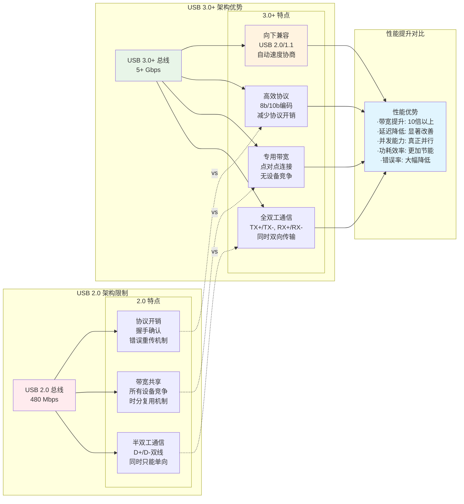
```mermaid
graph LR
    subgraph "USB 2.0 架构限制"
        U2[USB 2.0 总线<br/>480 Mbps]
        
        subgraph "2.0 特点"
            U2_1[半双工通信<br/>D+/D-双线<br/>同时只能单向]
            U2_2[带宽共享<br/>所有设备竞争<br/>时分复用机制]
            U2_3[协议开销<br/>握手确认<br/>错误重传机制]
        end
        
        U2 --> U2_1
        U2 --> U2_2
        U2 --> U2_3
    end
    
    subgraph "USB 3.0+ 架构优势"
        U3[USB 3.0+ 总线<br/>5+ Gbps]
        
        subgraph "3.0+ 特点"
            U3_1[全双工通信<br/>TX+/TX-, RX+/RX-<br/>同时双向传输]
            U3_2[专用带宽<br/>点对点连接<br/>无设备竞争]
            U3_3[高效协议<br/>8b/10b编码<br/>减少协议开销]
            U3_4[向下兼容<br/>USB 2.0/1.1<br/>自动速度协商]
        end
        
        U3 --> U3_1
        U3 --> U3_2  
        U3 --> U3_3
        U3 --> U3_4
    end
    
    subgraph "性能提升对比"
        PERF[性能优势<br/>·带宽提升: 10倍以上<br/>·延迟降低: 显著改善<br/>·并发能力: 真正并行<br/>·功耗效率: 更加节能<br/>·错误率: 大幅降低]
    end
    
    %% 对比连接
    U2_1 -.->|vs| U3_1
    U2_2 -.->|vs| U3_2
    U2_3 -.->|vs| U3_3
    
    %% 性能影响
    U3_1 --> PERF
    U3_2 --> PERF
    U3_3 --> PERF
    U3_4 --> PERF
    
    %% 样式
    style U2 fill:#ffebee
    style U3 fill:#e8f5e8
    style PERF fill:#e1f5fe
    style U3_4 fill:#fff3e0
```

## 7. USB调试和监控架构

### 7.1 完整调试生态系统

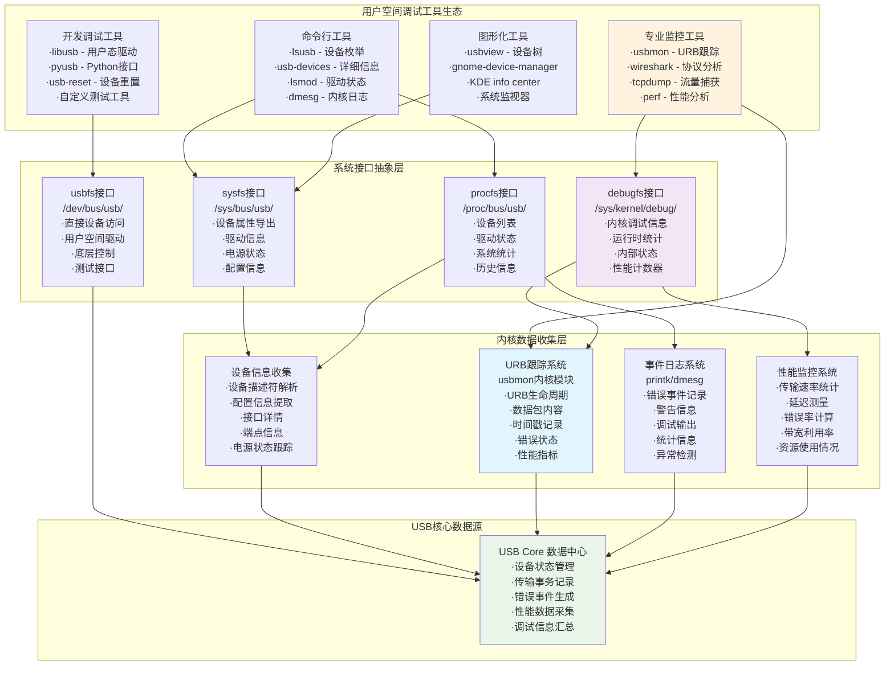
```mermaid
graph TB
    subgraph "用户空间调试工具生态"
        T1[命令行工具<br/>·lsusb - 设备枚举<br/>·usb-devices - 详细信息<br/>·lsmod - 驱动状态<br/>·dmesg - 内核日志]
        
        T2[专业监控工具<br/>·usbmon - URB跟踪<br/>·wireshark - 协议分析<br/>·tcpdump - 流量捕获<br/>·perf - 性能分析]
        
        T3[图形化工具<br/>·usbview - 设备树<br/>·gnome-device-manager<br/>·KDE info center<br/>·系统监视器]
        
        T4[开发调试工具<br/>·libusb - 用户态驱动<br/>·pyusb - Python接口<br/>·usb-reset - 设备重置<br/>·自定义测试工具]
    end
    
    subgraph "系统接口抽象层"
        I1[sysfs接口<br/>/sys/bus/usb/<br/>·设备属性导出<br/>·驱动信息<br/>·电源状态<br/>·配置信息]
        
        I2[debugfs接口<br/>/sys/kernel/debug/<br/>·内核调试信息<br/>·运行时统计<br/>·内部状态<br/>·性能计数器]
        
        I3[procfs接口<br/>/proc/bus/usb/<br/>·设备列表<br/>·驱动状态<br/>·系统统计<br/>·历史信息]
        
        I4[usbfs接口<br/>/dev/bus/usb/<br/>·直接设备访问<br/>·用户空间驱动<br/>·底层控制<br/>·测试接口]
    end
    
    subgraph "内核数据收集层"
        K1[设备信息收集<br/>·设备描述符解析<br/>·配置信息提取<br/>·接口详情<br/>·端点信息<br/>·电源状态跟踪]
        
        K2[URB跟踪系统<br/>usbmon内核模块<br/>·URB生命周期<br/>·数据包内容<br/>·时间戳记录<br/>·错误状态<br/>·性能指标]
        
        K3[事件日志系统<br/>printk/dmesg<br/>·错误事件记录<br/>·警告信息<br/>·调试输出<br/>·统计信息<br/>·异常检测]
        
        K4[性能监控系统<br/>·传输速率统计<br/>·延迟测量<br/>·错误率计算<br/>·带宽利用率<br/>·资源使用情况]
    end
    
    subgraph "USB核心数据源"
        CORE[USB Core 数据中心<br/>·设备状态管理<br/>·传输事务记录<br/>·错误事件生成<br/>·性能数据采集<br/>·调试信息汇总]
    end
    
    %% 工具到接口的连接
    T1 --> I1
    T1 --> I3
    T2 --> I2
    T2 --> K2
    T3 --> I1
    T4 --> I4
    
    %% 接口到内核的连接  
    I1 --> K1
    I2 --> K2
    I2 --> K4
    I3 --> K1
    I3 --> K3
    I4 --> CORE
    
    %% 内核模块到核心的连接
    K1 --> CORE
    K2 --> CORE
    K3 --> CORE
    K4 --> CORE
    
    %% 样式
    style T2 fill:#fff3e0
    style K2 fill:#e1f5fe
    style CORE fill:#e8f5e8
    style I2 fill:#f3e5f5
```

### 7.2 调试数据流和分析管道

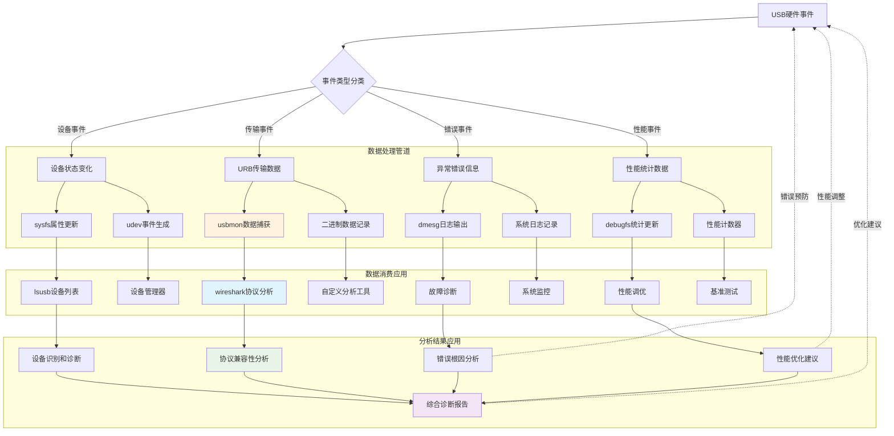
```mermaid
flowchart TD
    A[USB硬件事件] --> B{事件类型分类}
    
    B --> |设备事件| C[设备状态变化]
    B --> |传输事件| D[URB传输数据]
    B --> |错误事件| E[异常错误信息]
    B --> |性能事件| F[性能统计数据]
    
    subgraph "数据处理管道"
        C --> C1[sysfs属性更新]
        C --> C2[udev事件生成]
        
        D --> D1[usbmon数据捕获]
        D --> D2[二进制数据记录]
        
        E --> E1[dmesg日志输出]
        E --> E2[系统日志记录]
        
        F --> F1[debugfs统计更新]
        F --> F2[性能计数器]
    end
    
    subgraph "数据消费应用"
        C1 --> G1[lsusb设备列表]
        C2 --> G2[设备管理器]
        
        D1 --> H1[wireshark协议分析]
        D2 --> H2[自定义分析工具]
        
        E1 --> I1[故障诊断]
        E2 --> I2[系统监控]
        
        F1 --> J1[性能调优]
        F2 --> J2[基准测试]
    end
    
    subgraph "分析结果应用"
        G1 --> K1[设备识别和诊断]
        H1 --> K2[协议兼容性分析]
        I1 --> K3[错误根因分析] 
        J1 --> K4[性能优化建议]
        
        K1 --> L[综合诊断报告]
        K2 --> L
        K3 --> L  
        K4 --> L
    end
    
    %% 反馈回路
    L -.->|优化建议| A
    K3 -.->|错误预防| A
    K4 -.->|性能调整| A
    
    %% 样式
    style D1 fill:#fff3e0
    style H1 fill:#e1f5fe
    style K2 fill:#e8f5e8
    style L fill:#f3e5f5
```

## 8. USB知识体系和学习路径

### 8.1 USB知识体系架构图

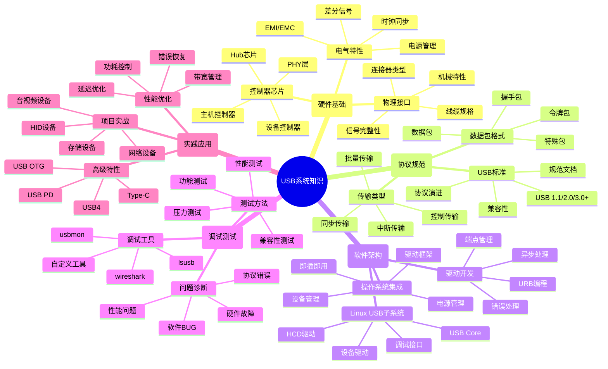
```mermaid
mindmap
  root((USB系统知识))
    (硬件基础)
      电气特性
        差分信号
        电源管理  
        时钟同步
        EMI/EMC
      物理接口
        连接器类型
        线缆规格
        机械特性
        信号完整性
      控制器芯片
        主机控制器
        设备控制器
        Hub芯片
        PHY层
    (协议规范)
      USB标准
        USB 1.1/2.0/3.0+
        协议演进
        兼容性
        规范文档
      传输类型
        控制传输
        批量传输
        中断传输
        同步传输
      数据包格式
        令牌包
        数据包
        握手包
        特殊包
    (软件架构)
      操作系统集成
        设备管理
        驱动框架
        电源管理
        即插即用
      Linux USB子系统
        USB Core
        HCD驱动
        设备驱动
        调试接口
      驱动开发
        URB编程
        端点管理
        异步处理
        错误处理
    (调试测试)
      调试工具
        lsusb
        usbmon
        wireshark
        自定义工具
      测试方法
        功能测试
        性能测试
        兼容性测试
        压力测试
      问题诊断
        硬件故障
        软件BUG
        协议错误
        性能问题
    (实践应用)
      项目实战
        HID设备
        存储设备
        网络设备
        音视频设备
      性能优化
        带宽管理
        延迟优化
        功耗控制
        错误恢复
      高级特性
        USB OTG
        USB PD
        Type-C
        USB4
```

### 8.2 技能发展路径图

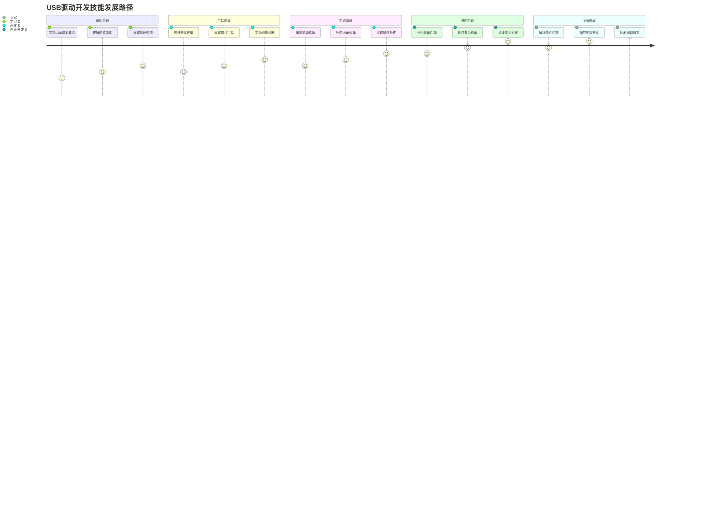
```mermaid
journey
    title USB驱动开发技能发展路径
    section 基础阶段
      学习USB基本概念: 3: 学习者
      理解硬件架构: 4: 学习者
      掌握协议规范: 5: 学习者
    section 工具阶段  
      搭建开发环境: 4: 开发者
      掌握调试工具: 5: 开发者
      学会问题诊断: 6: 开发者
    section 实践阶段
      编写简单驱动: 5: 开发者
      处理URB传输: 6: 开发者
      实现错误处理: 7: 开发者
    section 进阶阶段
      优化传输性能: 7: 高级开发者
      处理复杂设备: 8: 高级开发者
      设计架构方案: 9: 高级开发者
    section 专家阶段
      解决疑难问题: 8: 专家
      指导团队开发: 9: 专家
      技术创新研究: 10: 专家
```

## 总结

通过这些Mermaid可视化图表，我们全面展示了USB系统的完整架构：

### 🎯 **系统架构全景**
- **五层生态系统** - 从应用到硬件的完整视图
- **硬件架构细节** - 主机端、设备端、Hub的深度解析
- **数据流向清晰** - 完整的传输路径和处理机制

### 🚀 **核心机制可视化**  
- **状态管理** - 设备和端点的状态转换图
- **错误处理** - 多层协作的错误恢复架构
- **性能优化** - 带宽管理和队列优化策略

### 💡 **学习路径指导**
- **知识体系图** - 完整的技能图谱
- **发展路径** - 从新手到专家的成长轨迹
- **实践指导** - 调试工具和方法的系统化

### 📊 **文档使用建议**

**可视化版本 (Mermaid)**：
- ✅ **GitHub查看** - 获得最佳视觉体验和交互性
- ✅ **架构设计** - 作为系统设计的参考模板
- ✅ **团队分享** - 直观的架构演示和讨论
- ✅ **文档编写** - 专业的技术文档图表

**ASCII版本**：
- ✅ **本地开发** - 任意编辑器查看和编辑
- ✅ **终端环境** - SSH远程访问友好
- ✅ **打印文档** - 纸质版本效果好
- ✅ **版本控制** - Git diff清晰显示变化

现在您拥有了**双重保障**的USB学习资源：既有直观美观的可视化版本，又有通用兼容的文本版本，满足不同场景的使用需求！🎉
