# Linux USB内核架构详解（可视化版）

## 📌 文档组织思路

本文档通过Mermaid图表按照"**整体框架 → 子系统细化 → 数据结构关系 → 接口详解**"的顺序组织，帮助您逐层深入理解Linux USB内核架构。建议在GitHub网页端或支持Mermaid的编辑器中查看以获得最佳视觉效果。

> 💡 **提示**: 如需在本地编辑器查看，请参考对应的ASCII版本文档。

## 1. Linux USB子系统整体框架

### 1.1 USB子系统在内核中的位置（最高层视图）

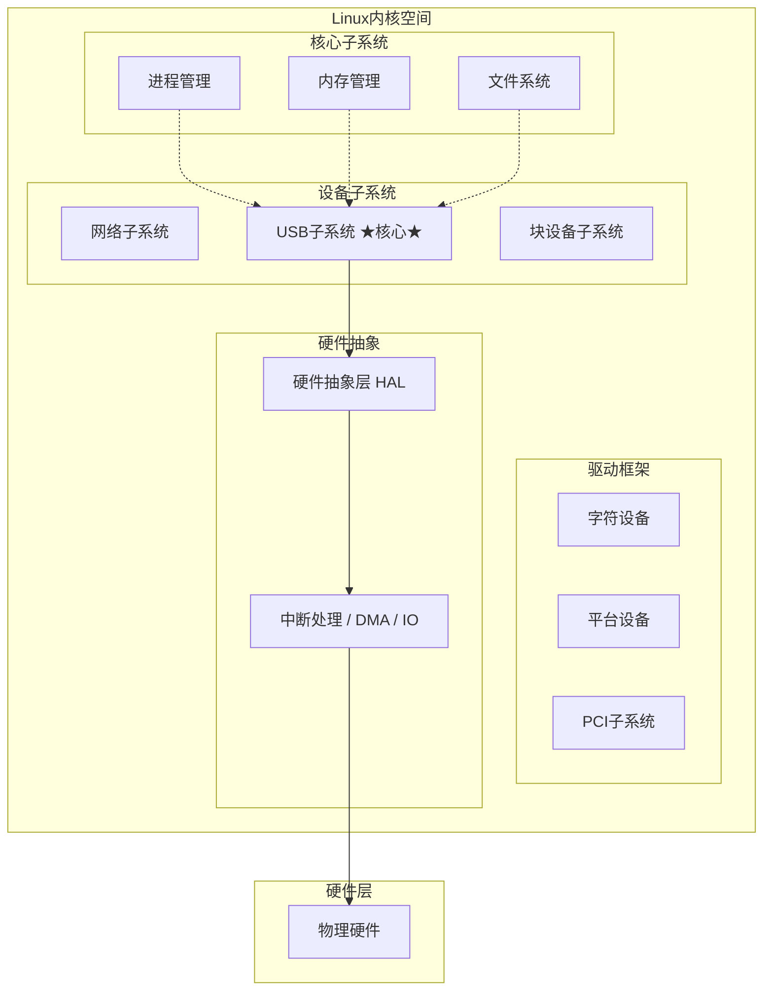

### 1.2 Linux USB子系统完整架构（核心视图）

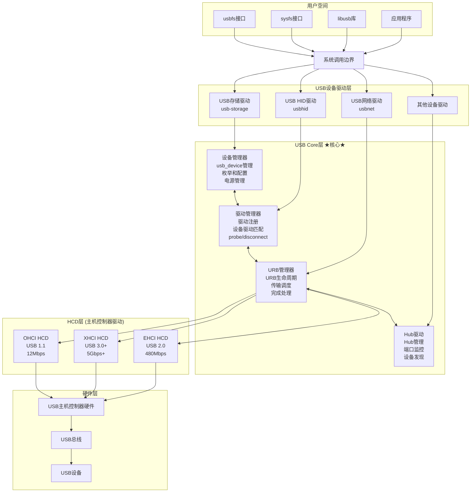

**架构关键点说明**：

- **用户空间接口**：提供多种访问USB设备的方式
- **设备驱动层**：实现具体设备类型的功能
- **USB Core层**：提供统一的USB协议处理和设备管理
- **HCD层**：硬件抽象，支持不同的USB控制器
- **硬件层**：物理USB控制器和设备

## 2. USB Core层详细架构

### 2.1 USB Core内部模块关系

```mermaid
graph TB
    subgraph "USB Core内部架构"
        subgraph "设备管理模块"
            USB_DEV_MGR[usb_device结构管理器<br/>设备生命周期管理]
            ENUM[设备枚举器<br/>设备发现和识别]
            CONFIG_MGR[配置管理器<br/>设备配置和状态管理]
        end
        
        subgraph "接口管理模块"
            USB_INTF_MGR[usb_interface管理器<br/>接口生命周期管理]
            EP_MGR[端点管理器<br/>端点配置和状态]
        end
        
        subgraph "URB处理模块"
            URB_ALLOC[URB分配器<br/>内存管理<br/>URB初始化]
            URB_SCHED[URB调度器<br/>队列管理<br/>优先级调度]
            URB_COMP[URB完成处理器<br/>回调处理<br/>错误处理]
        end
        
        subgraph "HCD接口模块"
            HCD_REG[HCD注册管理<br/>控制器注册]
            TRANSFER_SCHED[传输调度器<br/>硬件调度]
            IRQ_HANDLER[中断处理器<br/>硬件中断处理]
        end
    end
    
    %% 模块间连接
    USB_DEV_MGR <--> ENUM
    ENUM <--> CONFIG_MGR
    CONFIG_MGR <--> USB_INTF_MGR
    USB_INTF_MGR <--> EP_MGR
    
    EP_MGR --> URB_ALLOC
    URB_ALLOC --> URB_SCHED
    URB_SCHED --> URB_COMP
    
    URB_COMP --> HCD_REG
    HCD_REG <--> TRANSFER_SCHED
    TRANSFER_SCHED <--> IRQ_HANDLER
```

### 2.2 USB设备枚举详细流程

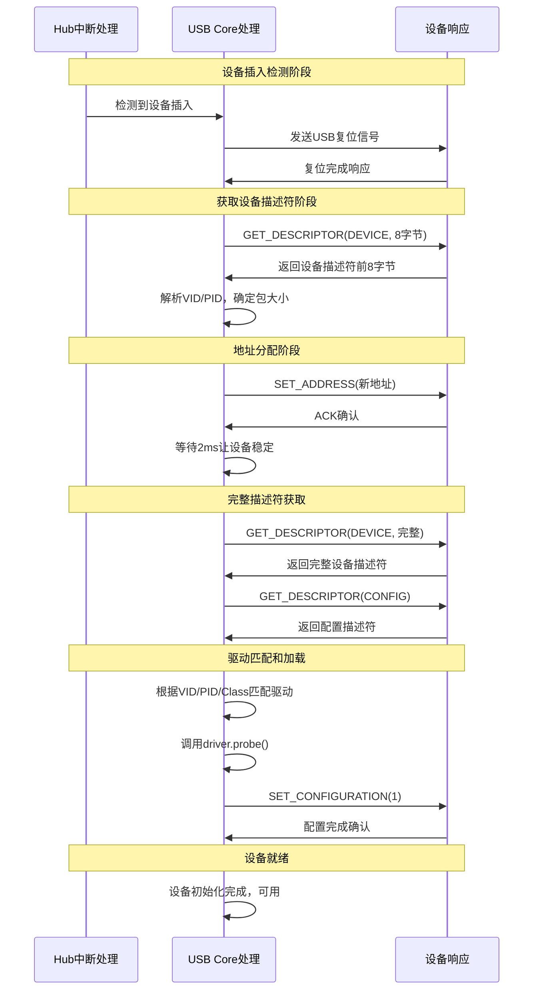

## 3. USB核心数据结构关系

### 3.1 核心数据结构关系图

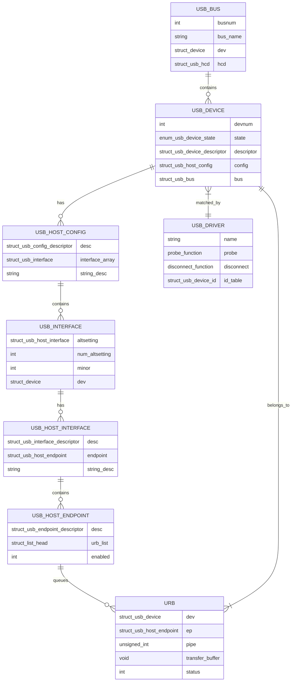

### 3.2 数据结构生命周期管理

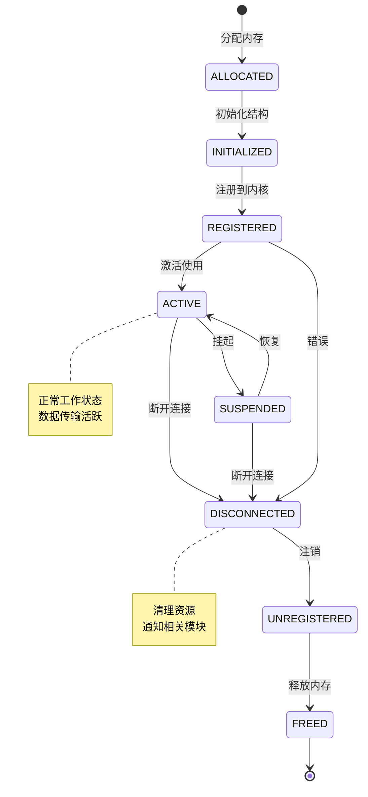

## 4. HCD (Host Controller Driver) 架构

### 4.1 HCD层架构设计

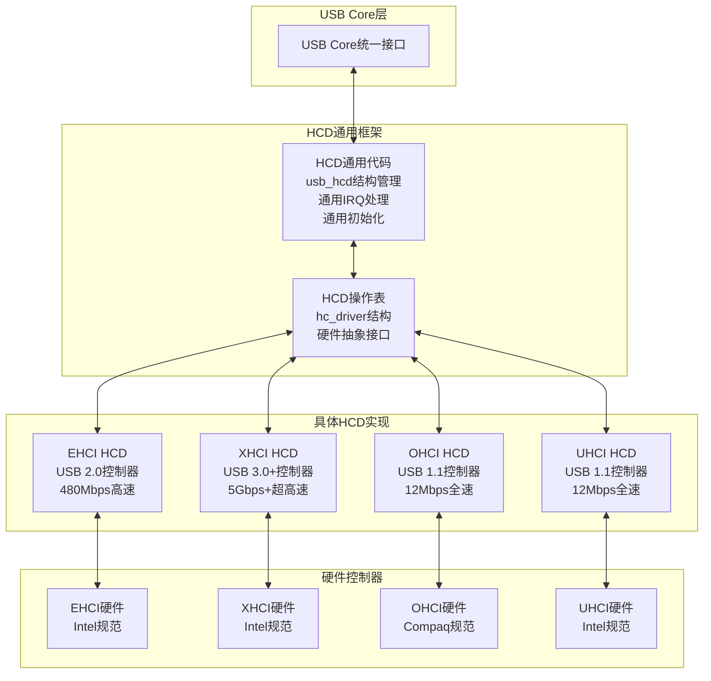

### 4.2 HCD操作接口表

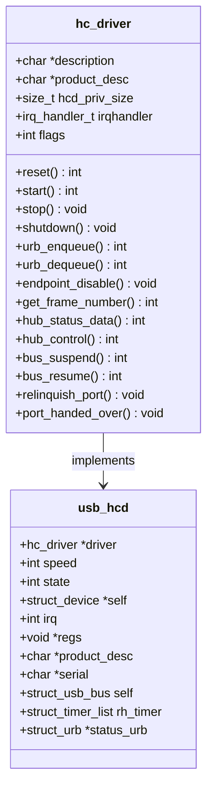

## 5. USB电源管理架构

### 5.1 USB电源管理层次

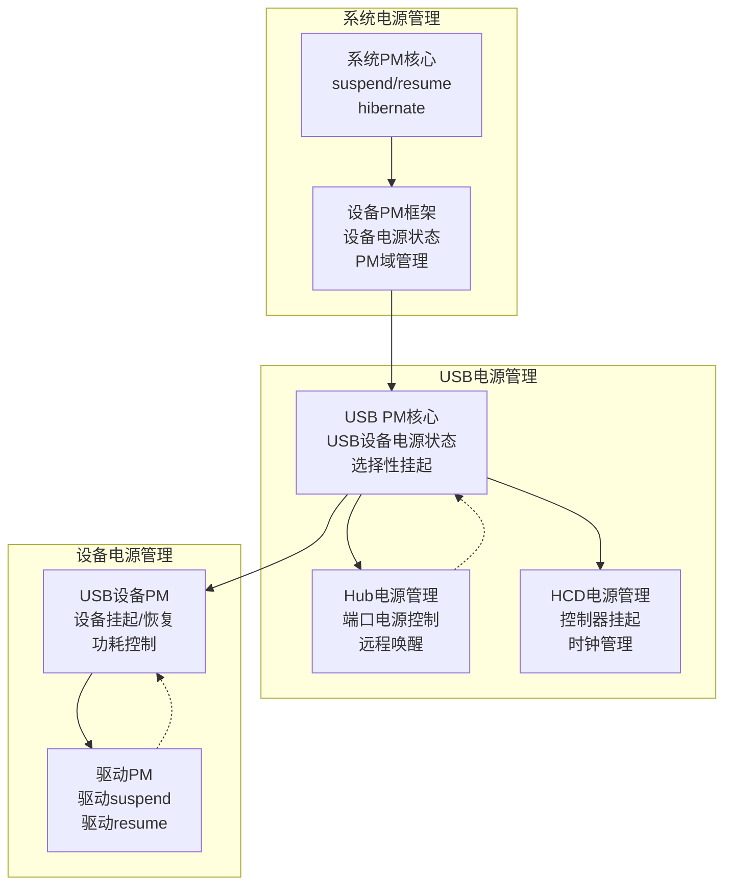

### 5.2 USB设备电源状态转换

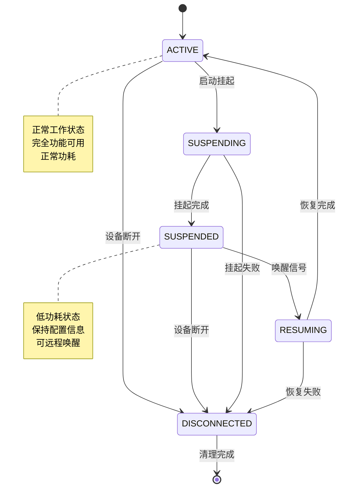

## 6. USB调试接口架构

### 6.1 USB调试信息导出架构

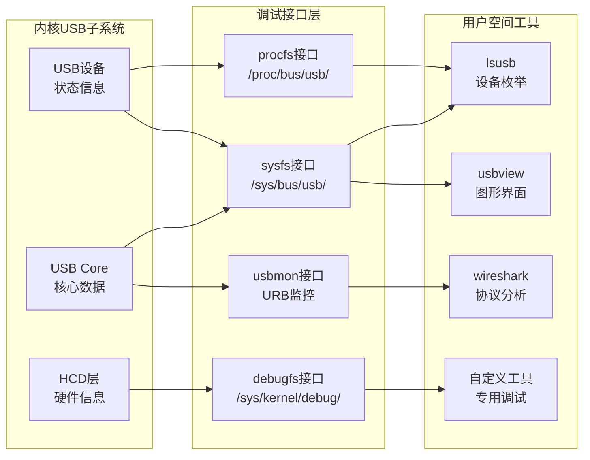

### 6.2 调试信息分类和用途

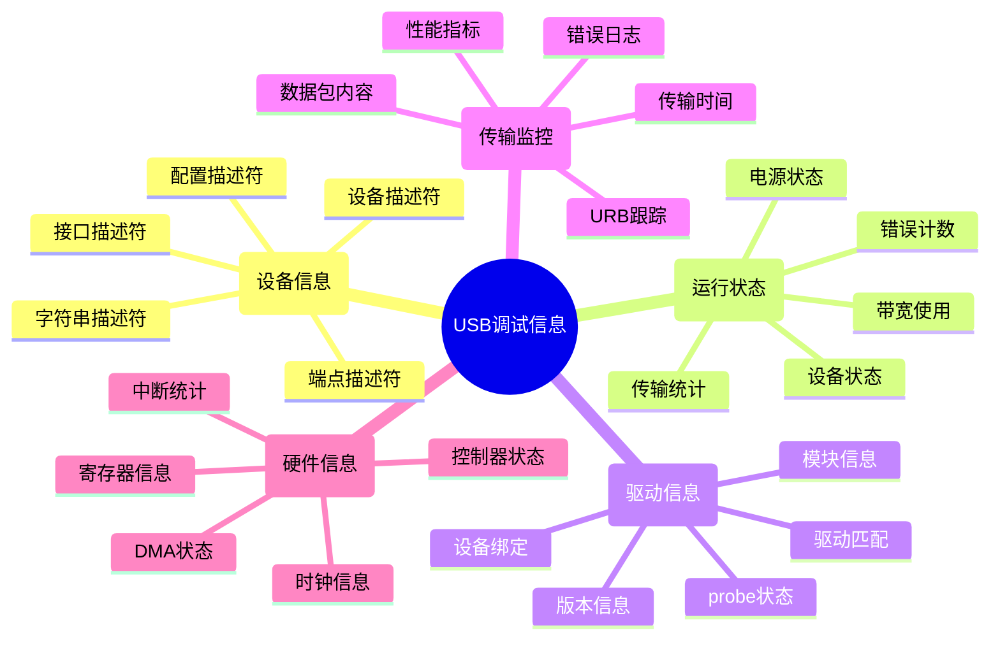

## 7. USB子系统初始化流程

### 7.1 USB子系统初始化序列

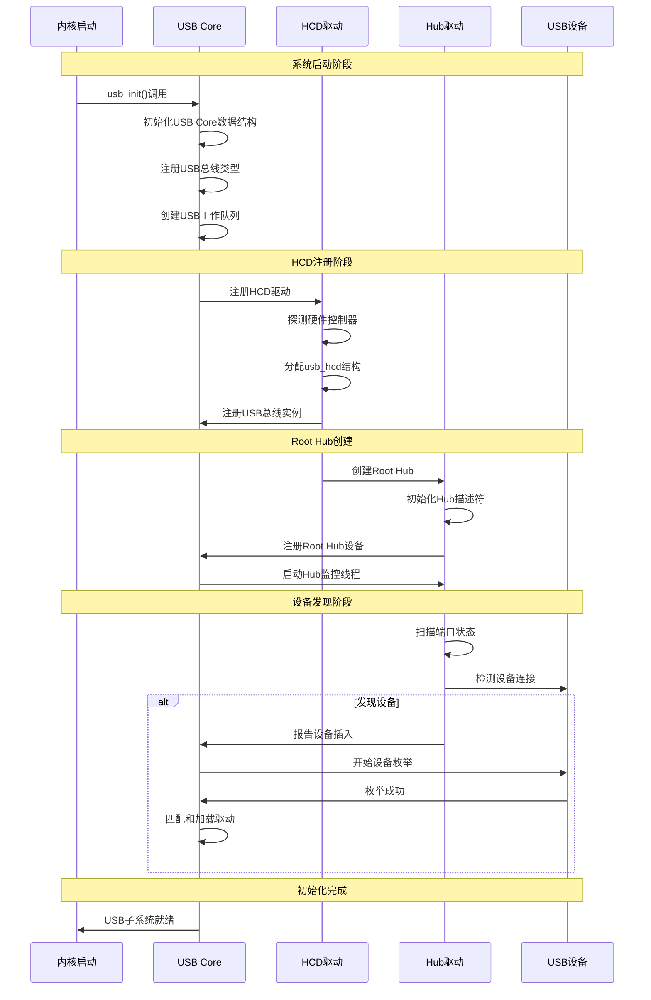

### 7.2 USB模块依赖关系

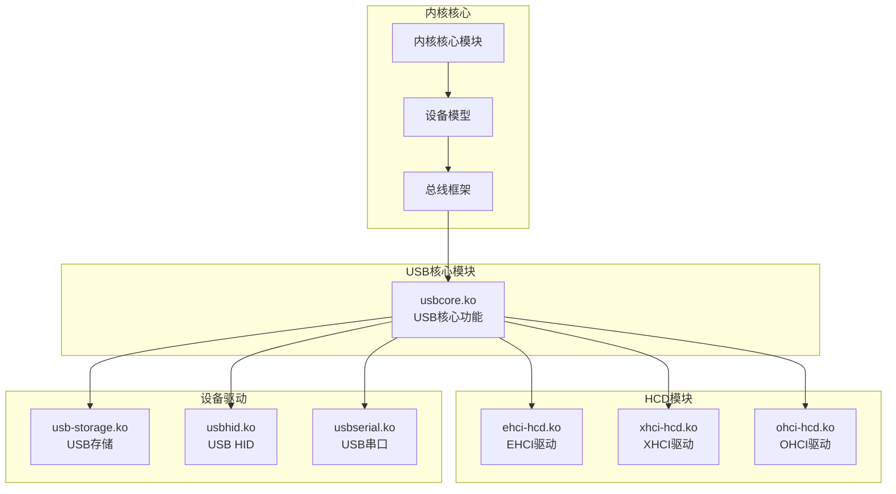

## 8. 关键函数调用关系

### 8.1 USB设备驱动关键API调用链

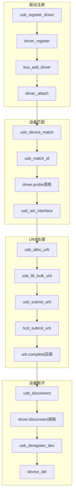

### 8.2 USB传输路径函数调用

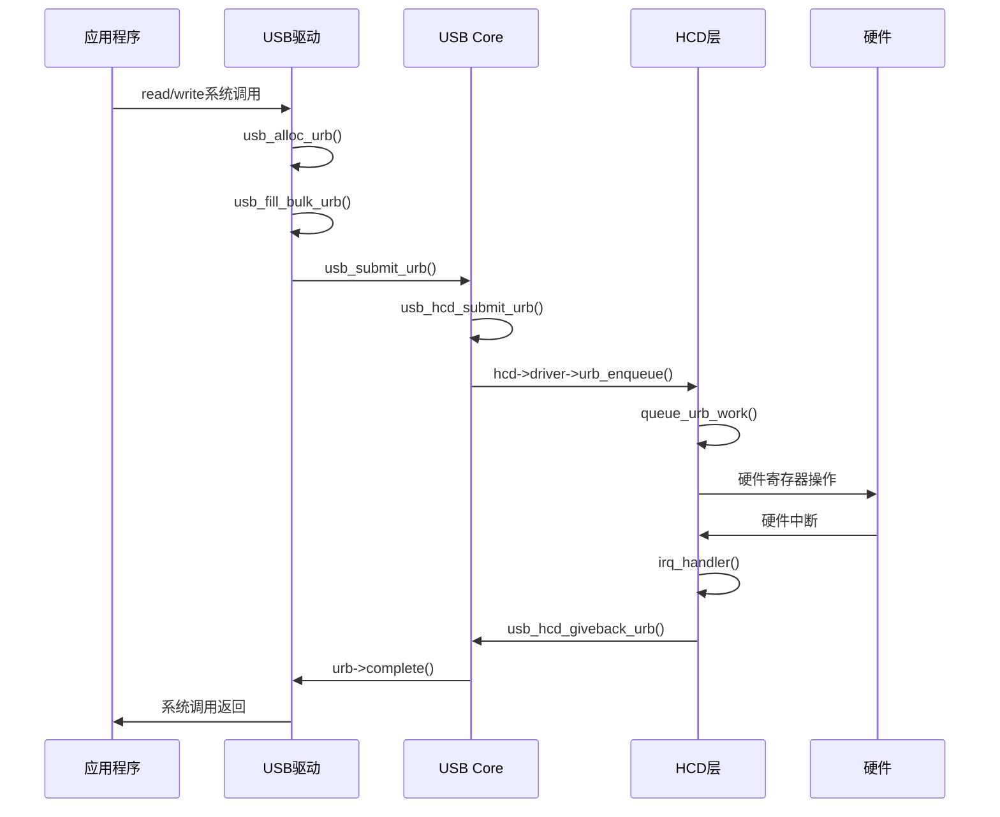

## 总结

通过这些可视化架构图，我们全面展示了Linux USB内核子系统的完整架构：

### 🎯 **核心架构理解**
1. **分层设计** - 从用户空间到硬件的清晰分层
2. **模块化结构** - USB Core、HCD、设备驱动的模块化
3. **数据结构关系** - 核心数据结构的生命周期和关系
4. **接口抽象** - 统一的HCD接口和驱动API

### 🚀 **系统设计原理**  
1. **硬件抽象** - HCD层提供统一的硬件抽象
2. **设备模型** - 基于Linux设备模型的USB设备管理
3. **电源管理** - 完整的USB电源管理架构
4. **调试支持** - 丰富的调试接口和监控机制

### 💡 **关键技术要点**
1. **URB机制** - USB请求块的完整处理流程
2. **设备枚举** - 详细的设备发现和配置过程
3. **驱动匹配** - 基于VID/PID的驱动自动匹配
4. **初始化流程** - 系统启动时的USB子系统初始化

### 📊 **学习建议**

**可视化版本优势**：
- ✅ **直观理解** - 通过图表快速理解复杂的架构关系
- ✅ **层次清晰** - 从整体到细节的递进式学习
- ✅ **关系明确** - 数据结构和模块间的关系一目了然
- ✅ **流程可视** - 初始化和函数调用流程直观展示

这个可视化版本为Linux USB内核开发提供了完整的架构参考，帮助开发者深入理解USB子系统的设计原理和实现细节。
